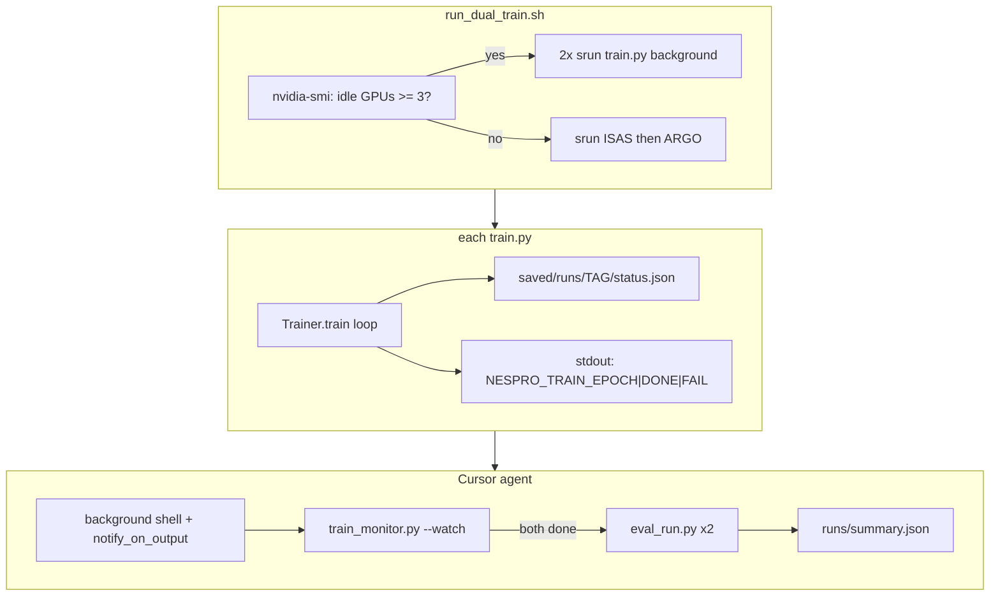

# Agent-autonomous dual-dataset training monitor

**Plan only** — ponytail mode. Governing style: fewest files, JSON status over log parsing,
shell sentinels for agent wake-ups, no W&B/MLflow/hooks unless needed later.

## Problem

Today the agent can start `train.py` in a background shell, but **cannot reliably know**:

- whether training is progressing vs stalled
- which run (ISAS vs ARGO) a log line belongs to
- when early-stop fired vs crash
- where `model_best.pth` landed for `eval_run.py`

Existing logs ([`NeSPReSO2_onTemplate/logger/logger_config.json`](NeSPReSO2_onTemplate/logger/logger_config.json) → `info.log`) are human-readable only. Epoch metrics print as unstructured lines in [`NeSPReSO2_onTemplate/base/base_trainer.py`](NeSPReSO2_onTemplate/base/base_trainer.py). TensorBoard is off. Parsing `info.log` with regex is fragile — ponytail: add one JSON status file instead of a monitoring framework.

## What the monitor should look for

### Per-run health (each of ISAS + ARGO)

| Signal | Healthy | Warning | Failure |
|--------|---------|---------|---------|
| **Process** | `srun` child alive, terminal file updating | — | exit_code ≠ 0, traceback, CUDA OOM |
| **Progress** | `status.json` `epoch` increments | same `epoch` + `updated_at` > 15 min | same epoch > 60 min |
| **Metric** | `val_loss` finite, trending down or plateauing | `val_loss` NaN/inf | metric key missing (`mnt_metric` bug) |
| **Early stop** | `state: done`, reason `early_stop` | — | `state: failed` |
| **Artifacts** | `model_best.pth` exists under `save_dir` | only epoch checkpoints | no checkpoint after epoch 1 |

### Orchestrator-level (both runs)

| Signal | Action |
|--------|--------|
| Both `state: done` | run `eval_run.py` on each `model_best.pth`, write `runs/summary.json` |
| One failed | report which tag failed; do not eval the failed run |
| GPU policy | **≥3 idle GPUs** → parallel `srun`; else sequential |
| Stall on both | notify user; optionally kill hung jobs |

### Post-train eval fields to capture

From existing [`NeSPReSO2_onTemplate/eval_run.py`](NeSPReSO2_onTemplate/eval_run.py):

- `loss`, `raw_profile_rmse.temperature`, `raw_profile_rmse.salinity`
- `dataset_tag`, `n_samples`, checkpoint path

**Do not** compare raw RMSE across tags (different depth grids) — report side-by-side only.

---

## Architecture (ponytail: 2 files + tiny trainer patch)



---

## Implementation (minimal code)

### 1. Trainer telemetry — ~15 lines in `trainer/trainer.py`

After each epoch log dict is built in `base/base_trainer.py` `train()`:

- Write `status.json` atomically to `{save_dir}/status.json`:

  ```json
  {
    "tag": "isas20",
    "state": "running",
    "epoch": 42,
    "max_epochs": 8000,
    "val_loss": 0.91,
    "train_loss": 0.88,
    "mnt_best": 0.87,
    "not_improved_count": 3,
    "early_stop": 500,
    "updated_at": "2026-06-16T12:34:56Z",
    "save_dir": "saved/models/..."
  }
  ```

- Print one stdout sentinel per epoch (agent regex target):

  ```
  NESPRO_TRAIN_EPOCH {"tag":"isas20","epoch":42,"val_loss":0.91}
  ```

- On normal exit: `NESPRO_TRAIN_DONE {...}` + `state: done`
- On exception (wrap `train()`): `NESPRO_TRAIN_FAIL {...}` + `state: failed`

`tag` comes from `config.config["io"]["dataset_tag"]` passed via `checkpoint_extra` or read from config in trainer.

ponytail: no TensorBoard, no W&B, no new deps.

### 2. Orchestrator — new `scripts/run_dual_train.sh`

Single bash entry point the agent always uses:

```bash
# pseudo
IDLE=$(nvidia-smi --query-gpu=utilization.gpu --format=csv,noheader,nounits | awk '$1<10{c++} END{print c+0}')
RUN_ROOT=saved/runs/$(date +%Y%m%d_%H%M%S)
mkdir -p "$RUN_ROOT"

run_one() {
  TAG=$1 CONFIG=$2
  srun --ntasks=1 --cpus-per-task=8 --gres=gpu:1 \
    python3 train.py -c "$CONFIG" \
    2>&1 | tee "$RUN_ROOT/${TAG}.log"
}

if [ "$IDLE" -ge 3 ]; then
  run_one isas20 config_isas.json &
  run_one argo_v2 config_argo.json &
  wait
else
  run_one isas20 config_isas.json
  run_one argo_v2 config_argo.json
fi
```

Also write `$RUN_ROOT/manifest.json` listing PIDs, configs, log paths, start time.

ponytail: `nvidia-smi` idle heuristic is naive (util < 10%); upgrade path = Slurm `sinfo`/`squeue` if needed.

### 3. Monitor CLI — new `scripts/train_monitor.py`

One stdlib script, two modes:

**`--once RUN_ROOT`** — print human summary, exit codes:

- `0` all runs done OK
- `1` still running
- `2` at least one failed/stalled

**`--watch RUN_ROOT`** — loop every 60s, print compact table until all terminal or timeout.

Reads:

- `$RUN_ROOT/manifest.json`
- each run's `status.json` (discovered via manifest or `saved/models/*/status.json`)
- terminal exit codes from agent terminal metadata (when invoked by agent)

Stall detection: `updated_at` older than 15 min while `state == running`.

### 4. Post-train eval hook — extend `eval_run.py`

Add `--out PATH` to write JSON (already prints JSON; just add file write). Orchestrator or agent calls:

```bash
python3 eval_run.py -c config_isas.json -r saved/models/.../model_best.pth --out runs/.../eval_isas.json
```

### 5. Agent workflow (no Cursor hooks required)

Use existing tools — **Loop skill + background shell + `notify_on_output`**:

1. **Launch** (background, `block_until_ms: 0`):

   ```bash
   srun --ntasks=1 --cpus-per-task=8 bash scripts/run_dual_train.sh
   ```

2. **Arm notification** on sentinel regex:
   - pattern: `NESPRO_TRAIN_(DONE|FAIL)`
   - reason: `train finished`

3. **On each `NESPRO_TRAIN_EPOCH`** (optional, debounce 5 min): run `train_monitor.py --once` for a progress update.

4. **On `NESPRO_TRAIN_DONE`**: verify both tags done → run `eval_run.py` twice → write `summary.json`.

5. **On `NESPRO_TRAIN_FAIL` or stall exit 2**: read `*.log` tail + `status.json`, report to user.

Fallback if notifications missed: `/loop 10m` with prompt "check train_monitor.py on RUN_ROOT".

**Do not build** Cursor hooks (`.cursor/hooks.json`) unless you want stop-hook automation later — file sentinels + shell notify are enough and repo-portable.

### 6. Config tweak — fixed `run_id` for discoverability

Add optional `run_id` in config or CLI `-id isas20_20260616` so `save_dir` is predictable:

```
saved/models/NeSPReSO2_ISAS_GoM/isas20_20260616/
```

Today `run_id` defaults to timestamp (`parse_config.py`); manifest.json avoids needing to guess paths.

### 7. Self-check — extend `selfcheck.py`

One assert: write fake status dict → `train_monitor.py --once` parses it. No pytest.

---

## What you (the user) do once

After implementation, a single message to the agent:

> Run and monitor the dual ISAS+ARGO training; eval when done.

Agent executes the workflow above without further prompting.

---

## Files touched (fewest possible)

| File | Change |
|------|--------|
| `NeSPReSO2_onTemplate/trainer/trainer.py` | status.json + sentinels |
| `NeSPReSO2_onTemplate/scripts/run_dual_train.sh` | **new** orchestrator |
| `NeSPReSO2_onTemplate/scripts/train_monitor.py` | **new** monitor CLI |
| `NeSPReSO2_onTemplate/eval_run.py` | `--out` flag |
| `NeSPReSO2_onTemplate/selfcheck.py` | monitor smoke test |
| `NeSPReSO2_onTemplate/README.md` | agent runbook section |

**Not building:** Slurm job arrays, MLflow, separate comparison notebook rewrite, Cursor hooks.

## Implementation todos

- [ ] Add status.json + NESPRO_TRAIN_* stdout sentinels to trainer loop
- [ ] Create scripts/run_dual_train.sh with GPU>=3 parallel policy + manifest.json
- [ ] Create scripts/train_monitor.py (--once / --watch, stall detection)
- [ ] Add --out JSON path to eval_run.py
- [ ] Extend selfcheck.py with monitor smoke test
- [ ] Document agent launch/monitor/eval workflow in README
