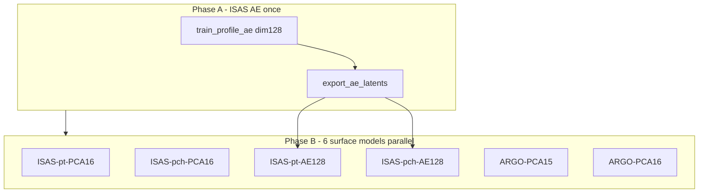

# Encoding/decoding comparison — train + notebook plots

**Status:** planned (not started)  
**Branch target:** `ISAS20_project` / `ISAS20_project-phase3-commit`  
**Created:** 2026-06-29

## Implementation todos

- [ ] Add 6 `config/compare/*.json` files (PCA-16, AE-128 ISAS point/patch; ARGO PCA-15/16) with 2k epochs, early_stop=200, pinned random split
- [ ] Add `scripts/run_encoding_compare_train.sh`: Phase A AE-128 + export_ae_latents, Phase B 6 parallel train.py jobs, manifest JSON
- [ ] Extend `nb_configs.py` + `nb_checkpoints.py` with `COMPARE_CONFIG_KEYS`, compare save dirs, no `KNOWN_CHECKPOINTS` fallback
- [ ] Extend `nb_metrics.py` for decoder decode path, overlay depth plot, best-model map selection helpers
- [ ] Rewrite `build_notebook.py` sections 0/2/5/6/7/7b; remove Section 3 inline AE; regenerate ipynb + update `run_compare.py`
- [ ] README encoding-compare blurb; run `selfcheck.py`; optional `benchmark_profile_ae_dims` reconfirm 128

---

## Problem today

The compare notebook mixes unrelated concerns:

- **Section 3** trains throwaway AEs on the test split (`AE_EPOCHS`) — not saved, not used downstream.
- **Section 5** uses smoke configs (`TRAIN_EPOCHS=100`, `monitor=off`) and discovers **legacy production** checkpoints via [`nb_checkpoints.KNOWN_CHECKPOINTS`](NeSPReSO2_onTemplate/notebooks/nb_checkpoints.py).
- **ISAS point** is 15 PCs while patch/ARGO are 16; **AE decoder configs** on disk use 16-dim latents, not the benchmark sweet spot.
- [`nb_metrics.run_inference`](NeSPReSO2_onTemplate/notebooks/nb_metrics.py) always PCA-inverts predictions — **decoder models would evaluate wrong**.

## Target comparison matrix

| Short label | Config base | Encoding | Latent dim / var | Surface arch |
|-------------|-------------|----------|------------------|--------------|
| `ISAS-pt-PCA16` | `config/isas/config_isas.json` | PCA | 16 | point MLP |
| `ISAS-pch-PCA16` | `config/isas/config_isas_patch.json` | PCA | 16 | patch conv |
| `ISAS-pt-AE128` | new point decoder | frozen AE | **128** | point MLP |
| `ISAS-pch-AE128` | new patch decoder | frozen AE | **128** | patch conv |
| `ARGO-PCA15` | `config/argo/config_argo.json` | PCA | 15 | point PatchConvMLP |
| `ARGO-PCA16` | `config/argo/config_argo.json` | PCA | 16 | point PatchConvMLP |

**AE dim 128** is documented in [`NeSPReSO2_onTemplate/README.md`](NeSPReSO2_onTemplate/README.md) (Phase 5 dim sweep: ISAS salinity AE best @ 128 via [`scripts/benchmark_profile_ae_dims.py`](NeSPReSO2_onTemplate/scripts/benchmark_profile_ae_dims.py)). **PCA stays 16** for all ISAS + ARGO-16; ARGO-15 is the only 15-dim variant.

AE surface models use `outputs: {temperature: 128, salinity: 128}` → `output_dim: 256`. PCA models use `16+16 → 32` (ARGO-15: `15+15 → 30`).



## 0. New compare config files (isolated from production)

Add six JSON configs under [`NeSPReSO2_onTemplate/config/compare/`](NeSPReSO2_onTemplate/config/compare/) (names illustrative):

- `isas_point_pca16.json` — `outputs` 16+16, `arch.output_dim` 32, `loss_config.mode: combined`
- `isas_patch_pca16.json` — same latent dims on existing patch arch
- `isas_point_ae128.json` — point arch, `outputs` 128+128, `output_dim` 256, `loss_config.mode: decoder`, `decoder_dir: saved/decoders/isas20/Autoencoder_dim128`, `target_key: ae_targets_dim128`
- `isas_patch_ae128.json` — patch arch + same decoder settings
- `argo_point_pca15.json` — `outputs` 15+15, `output_dim` 30, `io.refit_pca: true`
- `argo_point_pca16.json` — current ARGO 16+16

Shared trainer block for all six (compare study, not production 8k):

```json
"trainer": {
  "epochs": 2000,
  "save_dir": "saved/compare_runs/<key>/",
  "monitor": "min val_loss",
  "early_stop": 200,
  "save_period": 10,
  "log_interval": 10
}
```

Shared dataloader contract (pinned across all models for fair notebook eval):

- `split_mode: random`, `split_seed: 42`, `70/15/15` (matches prior compare-notebook intent; ISAS configs currently lack `split_mode` and default to random in loader).

Run [`scripts/derive_loss_scales.py`](NeSPReSO2_onTemplate/scripts/derive_loss_scales.py) once per new config to populate `loss_scales` (or copy scaled values from parent configs where architecture matches).

## 1. Headless parallel training script

Add [`NeSPReSO2_onTemplate/scripts/run_encoding_compare_train.sh`](NeSPReSO2_onTemplate/scripts/run_encoding_compare_train.sh) (or thin Python launcher) that:

1. **Phase A** (sequential, ISAS only):
   ```bash
   srun --ntasks=1 --cpus-per-task=8 --gres=gpu:1 \
     python3 scripts/train_profile_ae.py \
       -c config/compare/isas_patch_pca16.json \
       --encoding-dim 128 --arch-tag Autoencoder_dim128 --epochs 500
   srun ... python3 scripts/export_ae_latents.py \
       -c config/compare/isas_patch_ae128.json \
       --decoder-dir saved/decoders/isas20/Autoencoder_dim128 \
       --target-key ae_targets_dim128 --weight-key ae_weights_dim128
   ```
   (500 AE epochs: above benchmark default 200, below surface 2k; tunable via script flag.)

2. **Phase B** — launch **6** `train.py -c config/compare/....json` jobs **in parallel** (`&` + `wait`, or SLURM array). Each job is independent except AE pair waits on Phase A.

3. Write a manifest JSON (`saved/compare_runs/manifest.json`) with config path, short label, checkpoint path, and training status for the notebook to consume.

Optional sanity check before Phase A: rerun dim sweep on ISAS cache to reconfirm 128 (`benchmark_profile_ae_dims.py --dims 64,128,256`).

## 2. Notebook config registry

Extend [`notebooks/nb_configs.py`](NeSPReSO2_onTemplate/notebooks/nb_configs.py):

- `COMPARE_CONFIGS: dict[str, CompareSpec]` — maps short label → JSON path, `group` (`isas`|`argo`), `encoding` (`pca`|`ae`), `is_decoder: bool`
- `build_compare_config(key)` — loads compare JSON, resolves absolute paths
- Replace `SURFACE_CONFIG_KEYS` usage in compare notebook with `COMPARE_CONFIG_KEYS`
- Constants: `MAX_EPOCHS = 2000`, `PCA_DIM = 16`, `AE_DIM = 128`, `FORCE_RETRAIN`

Update [`notebooks/nb_checkpoints.py`](NeSPReSO2_onTemplate/notebooks/nb_checkpoints.py):

- `discover_compare_checkpoint(key)` searches `saved/compare_runs/<key>/model_best.pth` first; **do not** fall back to `KNOWN_CHECKPOINTS` for compare mode (avoids silently using mismatched production runs).

## 3. Fix metrics for decoder models

In [`notebooks/nb_metrics.py`](NeSPReSO2_onTemplate/notebooks/nb_metrics.py):

- Extend `run_inference` / `profile_metrics_from_pcs` to detect `loss_config.mode == "decoder"` and decode via `decode_latent_profiles` + frozen decoders (reuse logic from [`eval_run.raw_profile_rmse`](NeSPReSO2_onTemplate/eval_run.py) lines 78–95).
- Add `profile_metrics_from_inference(config, checkpoint, ...)` wrapper that picks PCA vs decoder path automatically.
- Add helpers:
  - `avg_common_rmse(metrics) -> float` — mean of T/S `raw_profile_rmse_common`
  - `select_best(rows, group)` — argmin by avg common RMSE within `isas` or `argo`
  - `plot_depth_rmse_overlay(rows, labels, colors)` — **one figure**, two subplots (T, S), all 6 depth-RMSE curves + legend
  - `plot_bin_maps_best(best_isas, best_argo)` — **four maps only**: T/S for best ISAS, T/S for best ARGO (reuse `bin_map_scalar_rmse` + `plot_bin_map`)

Remove or demote **Section 3** ephemeral `representation_metrics_on_split` from [`build_notebook.py`](NeSPReSO2_onTemplate/notebooks/build_notebook.py); replace with a short markdown note pointing to Phase A decoder artifacts (`saved/decoders/isas20/Autoencoder_dim128/`).

## 4. Notebook section changes ([`build_notebook.py`](NeSPReSO2_onTemplate/notebooks/build_notebook.py))

| Section | Change |
|---------|--------|
| 0 Setup | `COMPARE_CONFIG_KEYS`, `MAX_EPOCHS=2000`, `FORCE_RETRAIN`, load manifest if present |
| 2 Configs | Print compare matrix table (label, tag, arch, encoding, latent dims, epochs) |
| 3 | **Removed** inline AE training; optional: load decoder `val_rmse` from AE training summary JSON |
| 5 | Loop all 6 keys → `resolve_or_train(..., max_epochs=MAX_EPOCHS, force_train=FORCE_RETRAIN)` using compare checkpoint discovery |
| 6 | Summary table with short labels + `avg_common_rmse`; rank within ISAS / ARGO |
| 7 | **New overlay plot**: all 6 depth-RMSE curves (T subplot, S subplot), distinct colors, legend = short labels |
| 7b | **Maps**: only `best_isas` and `best_argo` by avg common RMSE — 4 spatial RMSE maps total |

Regenerate `compare_v2_vs_template.ipynb` via `python build_notebook.py`.

Update [`notebooks/run_compare.py`](NeSPReSO2_onTemplate/notebooks/run_compare.py) headless runner to use the same registry + overlay plot export (PNG to `compare_outputs/`).

## 5. Documentation snippet

Add a short "Encoding compare study" block to [`NeSPReSO2_onTemplate/README.md`](NeSPReSO2_onTemplate/README.md) comparison notebook section: run order (Phase A → parallel Phase B → notebook), config list, and the rule that **PCA-16 vs AE-128** are compared in **profile RMSE space** (common grid), not latent dimension count.

## Training / eval honesty checks

- Pair each checkpoint with the cache it was trained on (hard rule unchanged).
- Notebook `assert_matches_eval_run` for PCA configs; add decoder-mode cross-check against `eval_run.py` for AE configs.
- After implementation: `srun ... python3 selfcheck.py` (no new test framework; extend selfcheck only if decoder notebook path adds non-trivial decode logic).

## Out of scope (explicit)

- ARGO AE variants (user asked ARGO **15 vs 16 PCs** only).
- Changing production `config/isas/config_isas.json` / `config/argo/config_argo.json` (compare configs are copies).
- Dissertation L3/L4 configs.
