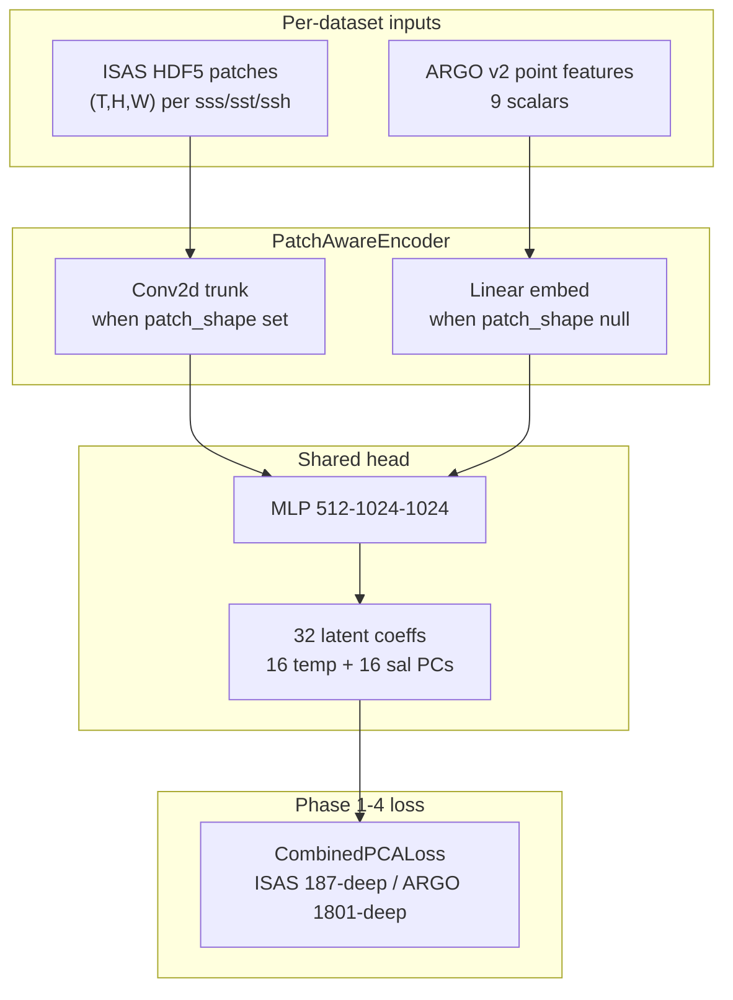
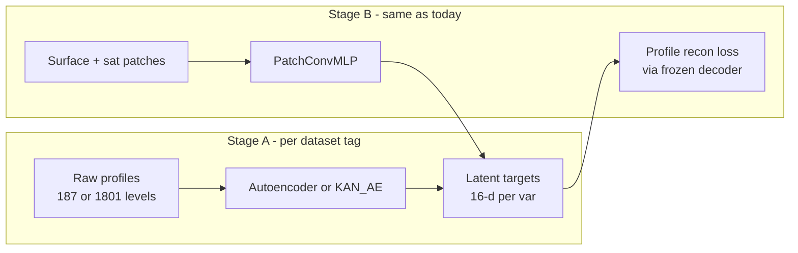

# Patch-Aware Architecture + ML Opt Handoff

**Saved:** 2026-06-17 (updated end-of-session)  
**Branch:** `nespreso-v2-port`  
**Status:** Phases 1–4 **done**; Phase 4b **exhausted** (individual levers and combined stack all miss 10% ARGO full-step bar); Phase 5 Stage A **in progress** (AE dim sweep done)

---

## Session handoff (read this first)

### What was completed this session

| Deliverable | Location |
|---|---|
| Final ISAS test eval (patch16 vs baseline15) | `saved/eval_patch16_test.json`, `saved/eval_baseline15_test.json` |
| Phase 4b `compile_loss` wiring | `playground/performance.py`, `train.py`, `benchmark_ml_opts.py` |
| ARGO max-batch benchmarks | `saved/benchmarks/batch_size_argo.json`, `ml_opts_argo_maxbatch.json` |
| `loss_config.mode=pred_profile_cached` | `model/loss.py`, cache preproc, `config_argo_pred_profile_cached.json` |
| Cached-loss benchmark | `saved/benchmarks/ml_opts_argo_pred_profile_cached.json` |
| TensorBoard enabled for GoM configs | `config_argo.json`, `config_isas.json`, `config_isas_patch.json` |
| Phase 5 Stage A smoke + AE dim sweep (16–256) | `scripts/train_profile_ae.py`, `scripts/benchmark_profile_ae_dims.py` |
| Phase 4b combined stack benchmark | `combo_phase4b_all` variant in `playground/performance.py` |
| AE sweep JSON | `saved/benchmarks/ae_dims_isas20_Autoencoder.json`, `ae_dims_argo_v2_Autoencoder.json` |
| Combined stack JSON | `saved/benchmarks/ml_opts_argo_combo_phase4b_all.json` |

### What is NOT done (next session starts here)

- [ ] **Phase 5 Stage A:** deeper/wider ARGO AE or longer training; KAN smoke on ISAS sal; fair PCA-X re-run
- [ ] **Phase 5 Stage B:** `DecoderProfileLoss` + latent cache export
- [x] ~~**Phase 4c (optional):** ISAS global scale-up + DDP~~ **Dropped** (Jun 2026) — GoM-only production; see [`PLAN-phase6.md`](PLAN-phase6.md)

### Training status (GoM, 16-PC + scales)

| Run | Config | Status | Notes |
|---|---|---|---|
| `argo16_scales` | `config_argo.json` | **done** (early stop @ 950) | test RMSE temp 0.416°C, sal 0.072 psu |
| `patch16_scales` | `config_isas_patch.json` | **done** (manual stop @ 3148) | test RMSE temp **1.016**, sal **5.32** |
| `baseline15pc` | `config_isas.json` | **done** (manual stop @ 1982) | test RMSE temp 1.002, sal 5.53 |

### Eval results (test split, final checkpoints)

| Model | temp RMSE | sal RMSE | Checkpoint maturity |
|---|---:|---:|---|
| PatchConvMLP 16-PC patch | **1.016** | **5.32** | final (`model_best`, run stopped @ epoch 3148) |
| PredictionModel 15-PC point | 1.002 | 5.53 | final (`model_best`, run stopped @ epoch 1982) |
| PatchConvMLP 16-PC ARGO | **0.416** | **0.072** | final (early stop @ 950) |

Basis differs for ISAS (16 vs 15 PCs). Patch ISAS wins on salinity RMSE; baseline slightly better on temperature (within noise).

### Phase 4b compile_loss results (Jun 2026, ARGO full step)

| Variant | sec/epoch | speedup vs baseline | val_loss |
|---|---:|---:|---:|
| baseline | 0.0231 | 1.00× | 0.139 |
| compile_loss | 0.0226 | 1.02× (~2%) | 0.137 |
| compile_both | 0.0224 | 1.03× (~3%) | 0.139 |

**Below 10% bar.** All Phase 4b levers exhausted at GoM scale; see batch + cached-loss tables below.

### Phase 4b combined stack (Jun 2026, ARGO full step)

| Variant | sec/epoch | vs baseline | batch |
|---|---:|---:|---:|
| baseline | 0.0246 | 1.00× | 512 |
| **combo_phase4b_all** | 0.0272 | **0.90× (~10% slower)** | 2755 |

Stack: `batch_size=0` (auto 2755) + `loss_config.mode=pred_profile_cached` + `compile(model+loss)`. **Do not enable combined** on GoM — compile overhead exceeds per-step savings at 1 batch/epoch.

JSON: `saved/benchmarks/ml_opts_argo_combo_phase4b_all.json`.

### Phase 4b pred_profile_cached results (Jun 2026, ARGO full step)

| Mode | sec/epoch | speedup vs combined | eval RMSE |
|---|---:|---:|---|
| `combined` (default) | 0.0231 | 1.00× | temp 0.416, sal 0.072 |
| `pred_profile_cached` | 0.0226 | 1.02× (~2%) | **identical** |

Enable via `"loss_config": { "mode": "pred_profile_cached" }`. Cuts half the PCA inverses in profile MSE; still below 10% bar on GoM.

### Phase 4b max batch results (Jun 2026, ARGO full step)

| Setting | batch | batches/epoch | sec/epoch | samples/s (epoch) | per-step samples/s | val_loss |
|---|---:|---:|---:|---:|---:|---:|
| `batch_size: 512` (kept in config) | 512 | 6 | 0.0233 | 124.6k | 222k | 0.139 |
| `batch_size: 0` → auto 2755 | 2755 | 1 | 0.0223 | 129.9k | 773k | 0.258* |

\* val_loss not comparable at equal epoch count (1 vs 6 optimizer steps/epoch). Epoch wall-clock speedup **~4.2%** — below 10% bar. Per-step throughput rises **3.5×** but GoM epoch overhead dominates. **Decision:** keep `config_argo.json` at `batch_size: 512` for v2 parity; use `batch_size: 0` only when maximizing samples/s and accepting 1 step/epoch.

JSON: `saved/benchmarks/batch_size_argo.json`, `saved/benchmarks/ml_opts_argo_maxbatch.json`.

### TensorBoard note

Killed runs had **`tensorboard: false`** — no `events.out.tfevents.*` files exist for them. View curves via `info.log` or `status.json`. TensorBoard is now **enabled** for future GoM runs; logs go to `saved/log/<exper_name>/<run_id>/`.

```bash
tensorboard --logdir saved/log --port 6006
```

### Phase 3 benchmark takeaways (Jun 2026, PatchConvMLP)

**ISAS patch** (`ml_opts_isas_patch_forward.json`): baseline forward **0.0254 s/epoch**; best forward `matmul_high` **0.0237 s/epoch** (~**7%**). Full-step best `autocast_fp16` ~7%. **Below 10% threshold — keep FP32 defaults on model.**

**ARGO point** (`ml_opts_argo_forward.json`): baseline forward **0.0139 s/epoch**; best forward `matmul_high` **0.0120 s/epoch** (~**14%** forward-only) but full epoch **0.0241 → 0.0246** (neutral/slower). **Loss + backward dominate; model `performance` block not worth enabling.**

**What “loss-dominated” means:** `CombinedPCALoss` already runs on GPU (`pcs @ components + mean` in [`model/loss.py`](NeSPReSO2_onTemplate/model/loss.py)). ARGO does **four** profile reconstructions per variable per step (pred/true × pred/true profiles) at **16 × 1801** matmuls. Forward is ~42% of epoch time on ARGO; the rest is loss backward + Adam. This is not a CPU sklearn problem — it is **GPU matmul volume in the loss**.

### 16-PC loss scales (derived from caches)

```bash
python3 scripts/derive_loss_scales.py -c config_isas_patch.json --update-config
python3 scripts/derive_loss_scales.py -c config_argo.json --update-config
```

| Tag | `profile_scales` (temp / sal) | `combined_pca_scale` | `combined_mse_scale` |
|---|---|---:|---:|
| ISAS patch | 6.0308 / 102.758 | 2.0 | 4.1592 |
| ARGO point | 2.0029 / 0.0313 | 2.0 | 0.2174 |

Method: per-variable profile MSE at zero-PC init; combined PCA scale = sum of normalized terms (= 2.0 for two outputs).

### Brutally honest takeaways

1. **Tuning the MLP forward pass is the wrong lever on ARGO.** We measured ~14% forward-only gain and **zero** full-epoch gain. The profiler was right: `aten::mm` in PCA reconstruction and `Adam.step` eat the step. A bigger `PatchConvMLP` helps ISAS more than ARGO.

2. **The loss is already on GPU.** “Push it to GPU” is already done. Speedups require **less loss work**, **better batching**, or **compiling/fusing the loss graph** — not moving sklearn to CUDA.

3. **`PCALoss` is wasteful by construction.** Four inverse transforms per variable per step (`pred` and `true` PCs both reconstructed for both sides of profile MSE). That is ~10× worse on ARGO (1801 levels) than ISAS (187). Any serious speed effort starts here.

4. **GoM batch counts are tiny; optimizations have overhead tax.** ISAS patch auto-resolves to **~2 batches/epoch** (batch 3353, train N≈3530). ARGO runs **~6 batches/epoch** at batch 512 but could use **~2755** (VRAM probe). Small epoch = kernel launch + Python + compile warmup dominate.

5. **16-PC was the right science call, not a free speed win.** New caches, new scales, broken v2 pins — all handled — but PCA-16 does not shrink the 1801-deep ARGO inverse.

6. **`compute_input_dim` / patch pipeline: fixed.** Do not repeat the old blocker warning; patch training works. `batch_size=0` needed fixes in benchmark and eval (done).

7. **`performance` block on model: leave off.** ISAS &lt;10% forward threshold; ARGO loss-dominated. Revisit only after Phase 4b compiles **loss** or enlarges batch.

8. **AE/KAN is not a guaranteed speed fix.** It is a **representation change** that *might* let you optimize a smaller decoder graph — or might be slower (KAN splines). Treat as Phase 5 science with a speed go/no-go gate.

9. **DDP still helps wall-clock at scale** (~1.39× seen on ISAS smoke) by splitting batches across ranks — not because the step got cheaper.

10. **Do not chase flash attention / ZeRO / quantization.** Wrong problem entirely.

### Recommendations (priority order)

**Done (Phases 1–3):** patch arch, 16-PC, loss scales, forward-only benchmarks, ARGO E2E.

**Next — Phase 4 wrap-up:**
1. Finish ISAS train + final eval (`patch16_scales` vs `baseline15pc`).
2. Document RMSE in README.

**Next — Phase 4b loss-speed (see full roadmap below):**
1. ~~**Batch size**~~ — **done:** max fit 2755; ~4% epoch speedup vs 512 (below 10% bar); config stays 512.
2. ~~**Compile loss**~~ — **done:** ~3% ARGO full-step (below 10% bar).
3. ~~**Cheaper loss variants**~~ — **done:** `loss_config.mode=pred_profile_cached` (~2% ARGO full-step, same eval RMSE); `pc_mse_only` stubbed.
4. **Phase 5 AE/KAN** — only after PCA-16 eval acceptable; measure decoder FLOPs vs PCA inverse before committing.

### Quick commands for next session

```bash
cd NeSPReSO2_onTemplate

# Health
srun --ntasks=1 --cpus-per-task=8 python3 selfcheck.py

# Final eval (after training converges)
srun --ntasks=1 --cpus-per-task=8 --gres=gpu:1 \
  python3 eval_run.py -c config_isas_patch.json \
  -r saved/models/NeSPReSO2_ISAS_GoM_patch/patch16_scales/model_best.pth --split test
srun --ntasks=1 --cpus-per-task=8 --gres=gpu:1 \
  python3 eval_run.py -c config_isas.json \
  -r saved/models/NeSPReSO2_ISAS_GoM/baseline15pc/model_best.pth --split test

# Loss scales (if caches change)
python3 scripts/derive_loss_scales.py -c config_argo.json --update-config

# Forward-only benchmark (already run; re-run after loss changes)
srun --ntasks=1 --cpus-per-task=8 --gres=gpu:1 \
  python3 scripts/benchmark_ml_opts.py -c config_argo.json --forward-only \
  --out saved/benchmarks/ml_opts_argo_forward.json

# Batch-size probe (ARGO — suggestion 1)
srun --ntasks=1 --cpus-per-task=8 --gres=gpu:1 \
  python3 scripts/benchmark_batch_size.py -c config_argo.json
```

---

## Phase 4b — Loss-speed roadmap (ARGO-first)

**Problem:** Full training step time is dominated by `CombinedPCALoss` backward through **1801-level** profile reconstructions on ARGO, not by `PatchConvMLP` forward. Model-level `performance` knobs underperform.

**Goal:** Reduce per-step wall time without abandoning dual-dataset parity. ISAS benefits indirectly; ARGO is the pain point.

### Suggestion 1 — Maximize batch size (low risk, do first) — **done Jun 2026**

| Item | Detail |
|---|---|
| **What** | ARGO `config_argo.json` uses `batch_size: 512`. VRAM probe confirmed **max fit = 2755** on A100 80GB (~215 MiB peak). ISAS patch auto-probes via `batch_size: 0` → ~3353. |
| **Result** | Per-step throughput 222k → 773k samples/s (3.5×), but full-epoch wall-clock only **~4.2% faster** (0.0233 → 0.0223 s/epoch) — below 10% bar. Config kept at 512 for v2 parity. |
| **JSON** | `saved/benchmarks/batch_size_argo.json`, `saved/benchmarks/ml_opts_argo_maxbatch.json` |

### Suggestion 2 — Compile the loss path, not just the model (medium risk)

| Item | Detail |
|---|---|
| **What** | `performance.compile` today wraps only `PatchConvMLP`. Extend benchmark/train to compile **`CombinedPCALoss`** or the entire forward+loss callable used in the training step. |
| **Why it helps** | Profiler top ops are `aten::mm` inside `PCALoss.forward` — exactly what `torch.compile` targets. Forward-only ARGO gain was 14% but lost in full step; compiling loss+backward may capture it. |
| **Work** | Add `performance.compile_loss: true` in config; in `train.py` / `benchmark_ml_opts.py`, `criterion = maybe_compile_model(criterion, True)`; add `--profile` loss-top-ops; benchmark ARGO full step vs forward-only. |
| **Honest expectation** | **Uncertain.** Compile warmup hurts tiny GoM runs. May help more when batch is large and step count is high. First compile can be slower than baseline — measure steady-state after warmup. |
| **Risk** | Medium. Compile + dynamic shapes + `torch.autocast` interactions need testing. Validate `val_loss` drift (benchmark already flags &gt;1%). |

### Suggestion 3 — Reduce loss FLOPs (higher risk — changes objective)

| Item | Detail |
|---|---|
| **What** | `PCALoss` reconstructs **both** pred and true PCs into profile space every step. Cheaper variants: |
| | **(a)** `weighted_mse_only` — drop profile MSE branch; train on PC space only (fast, but diverges from v2 objective). |
| | **(b)** `pred_profile_mse` — reconstruct **pred only**, compare to **precomputed true profiles** cached in GPU tensors (cuts inverses in half). |
| | **(c)** `depth_masked_loss` — MSE only on valid depth levels (helps ISAS NaN salinity; fewer wasted FLOPs on zero-filled PCA fit). |
| | **(d)** Fuse `true` branch — true profiles are constant per sample; cache `true_profiles` in cache pickle, stop re-inverse-transforming targets every step. |
| **Work** | Add `loss.mode` in config (`combined` / `pc_mse_only` / `pred_profile_cached`); implement in [`model/loss.py`](NeSPReSO2_onTemplate/model/loss.py); `selfcheck.py` golden update; eval RMSE comparison required. |
| **Honest expectation** | **(d)** is the best speed/quality trade — same math, fewer matmuls. **(a)** is fastest but may hurt profile RMSE. **(b)/(c)** need careful NaN handling on ISAS. |
| **Risk** | High for (a); medium for (b–d). Any change breaks v2 loss parity — document and re-derive scales. |

### Suggestion 6 — Phase 5 learned latent (AE / KAN) (science bet, speed TBD)

| Item | Detail |
|---|---|
| **What** | Replace sklearn PCA inverse with a **frozen MLP decoder** trained per tag (ISAS 187-deep, ARGO 1801-deep). Surface model still predicts 16-d latent; loss = decoder(latent) vs true profile. |
| **Why it might help** | Decoder can be **narrower** than full PCA matrix if bottleneck is structured; `torch.compile` on a small decoder may beat four sparse PCA inverses. Latent training is 16-d — matmul-friendly. |
| **Why it might not** | AE decoder still maps 16→1801 every step — same output shape as PCA. **KAN splines are expensive**; default `KAN_Autoencoder` may be slower than PCA. Two-stage pipeline adds ops burden. |
| **Work** | Stage A: train/freeze AE per tag (mask-aware). Stage B: export latent targets to cache; swap `CombinedPCALoss` for `DecoderProfileLoss`. Compare RMSE **and** `benchmark_ml_opts.py` full step. |
| **Honest expectation** | **Science first, speed second.** Only pursue if PCA-16 eval is acceptable **and** compiled decoder beats PCA inverse in A/B benchmark. Otherwise keep PCA. |
| **Risk** | High complexity. Per-tag decoders, NaN masks, depth grid mismatch ISAS vs ARGO. Do not start until Phase 4 eval is signed off. |

### Phase 4b success criteria

1. ARGO full-step benchmark shows **≥10% speedup** from at least one of: max batch, compile-loss, or cached-true-profile loss — **without** val_loss drift &gt;1%.
2. If none hit 10%, document that GoM ARGO is **fast enough** and reserve optimizations for global scale.
3. Phase 5 go/no-go doc: decoder vs PCA inverse on RMSE **and** sec/step.

---

## Roadmap todos

| ID | Status | Task |
|---|---|---|
| `fix-input-dim` | **done** | Fix `compute_input_dim`; patch metadata in cache; selfcheck validation |
| `pca-16-components` | **done** | 16 PCs per var; ARGO PCA refit; loss scales derived; selfcheck passes |
| `implement-patch-conv-mlp` | **done** | `PatchConvMLP` in `model/model.py` |
| `patch-configs` | **done** | `config_isas_patch.json` + twin ARGO config |
| `rebenchmark-arch` | **done** | Forward-only benchmarks on patch + ARGO configs |
| `run-compare-document` | **done** | ARGO + ISAS eval complete; patch16 wins sal RMSE |
| `loss-speed-batch` | **done** | ARGO max batch probed (2755); ~4% epoch speedup vs 512 — below 10% bar; config stays 512 |
| `loss-speed-compile` | **done** | `torch.compile` on `CombinedPCALoss` — ~3% ARGO full-step (&lt;10% bar) |
| `loss-speed-cheaper` | **done** | Cached true profiles / `loss_config.mode=pred_profile_cached` — ~2% ARGO full-step (0.0230→0.0226 s/epoch); eval RMSE identical; val_loss drift ~1.2% in 100-epoch bench noise |
| `ae-kan-latent-roadmap` | **in progress** | Stage A: `scripts/train_profile_ae.py` — see [PLAN-phase5.md](PLAN-phase5.md) |

---

# Patch-Aware Architecture for GPU Optimization Gains

## Research summary

### Why the current model does not benefit

The production [`PredictionModel`](NeSPReSO2_onTemplate/model/model.py) (`9→512→512→30`, ~283K params) is too small and too fast per step for the optimizations we benchmarked. Profiler data (`saved/benchmarks/ml_opts_isas_full.json`) shows **CUDA time in `Adam.step` and PCA-loss `aten::mm`**, not MLP forward. With only **~6–7 batches/epoch** on GoM, kernel-tuning overhead often exceeds savings.

To make `autocast`, `matmul_precision`, `torch.compile`, and `fused Adam` matter, we need **more forward-pass matmul/conv FLOPs per step** and/or **more steps per epoch** (larger N or smaller effective batch under DDP).

### Measured ML opt results (Jun 2026, already run)

**ISAS** — baseline `0.0256 s/epoch`; best single-GPU variant was baseline itself (1.00×). `autocast_bf16` was 0.82×.

**ARGO** — baseline `0.0214 s/epoch`; `matmul_highest` / `fused_adam` ~1.01× (noise).

**DDP 2-GPU** — `0.0184 s/epoch` vs `0.0256` 1-GPU (~1.39× faster per epoch).

### Architectures in repo (fit for surface → PCA regression)

| Architecture | Task fit | Opt benefit | Dual-dataset ready? |
|---|---|---|---|
| [`PredictionModel`](NeSPReSO2_onTemplate/model/model.py) / `FFNN` | **Yes** (current v2 path) | **Low** (~283K params) | Yes (config `input_dim`) |
| **Scaled `PredictionModel` on patch vectors** | **Yes** | **Medium–High** (3–15M+ params) | Yes, with pad-aware `input_dim` fix |
| **`PatchConvMLP` (recommended, Phase 1–4)** | **Yes** — uses spatial/temporal sat context | **High** (conv + large linear) | Yes — point branch for ARGO, conv branch for ISAS |
| `Autoencoder` / `KAN_Autoencoder` | **Phase 5** — learned latent space **replacing PCA** | Medium–High (wider encoder/decoder) | Yes, after latent-training pipeline exists |
| Transformer + flash attention | Possible but overkill | Low at GoM scale (~12–100 tokens) | Possible, more plumbing |
| v2 `VAE` / playground `DIRESA` | Different pipeline (TF/Keras) | Not integrated | No |

### Input datasets / patch pipeline (already in repo)

The satellite patch pipeline is **ready** in [`preproc/preproc_isas_sat.py`](NeSPReSO2_onTemplate/preproc/preproc_isas_sat.py):

- `extract_sat_values()` handles `(N,T,H,W)` HDF5 slices → flattened patch or center pixel
- Legacy defaults: `spatial_pad=2`, `temporal_pad=3` → **5×5 spatial × 4 time × 3 vars + 6 encodings = 306 features**
- GoM ISAS HDF5 already stores **7×33×33** patches per variable — can also use `spatial_pad=16` (full grid)
- v1 global path exists via legacy `preprocess_data()` + [`preproc_isas_confiv.json`](NeSPReSO2_onTemplate/preproc/preproc_isas_confiv.json) (881K stations; throughput play)
- ARGO [`export_v2_cache.py`](NeSPReSO2_onTemplate/preproc/export_v2_cache.py) exports **point inputs** from v2 pickle (~9 dims today); patches not required for dual-dataset parity

**Blocker (resolved):** `compute_input_dim()` now includes `spatial_pad` / `temporal_pad`; patch training validated via `selfcheck.py` and smoke runs.



---

## Recommendation: `PatchConvMLP` + patch-enabled ISAS configs

**Best balance of constraints** (leverage patch pipeline, train both datasets with minimal changes, pursue throughput):

### Architecture

Add [`PatchConvMLP`](NeSPReSO2_onTemplate/model/model.py) (name flexible):

1. **Encoding branch (6 dims):** time/lat/lon sin/cos → small linear → `d_model` (64–128)
2. **Satellite branch (mode-dependent):**
   - **Point mode** (`spatial_pad=0`): 3 scalars → linear → `d_model` (ARGO + ISAS point baseline)
   - **Patch mode** (`spatial_pad>0`): reshape flattened sat block to `(B, 3, T, H, W)` using cache metadata → `Conv2d` stack (e.g. `3→32→64`, kernel 3, GAP) → linear → `d_model`
3. **Fusion:** concat or add encoding + sat embeddings
4. **Head:** `Linear(d_model → 1024 → 1024 → 32)` with dropout 0.2 — **16 PCs per variable** (`output_dim = 32`)
5. **Parameter target:** ~2–8M params (10–30× current) — enough for `autocast`/`compile`/`matmul_high` to show gains on forward pass

### Latent dimension: 16 + 16 (power-of-2 via `n_components`, not padding)

Instead of padding 15→16 with dummy coefficients, set in both twin configs:

```json
"outputs": { "temperature": 16, "salinity": 16 },
"arch": { "args": { "output_dim": 32 } }
```

**Why:** `output_dim=32` and per-variable `n_components=16` are powers of 2, which can help GPU matmul tiling in the PCA inverse (`pcs @ components`) without artificial features. This is a real basis change, not zero-padding.

**Caveats (must handle in implementation):**
- ISAS: PCA refit in [`build_train_cache()`](NeSPReSO2_onTemplate/preproc/preproc_isas_sat.py) — straightforward
- ARGO: v2 pickle ships **15-component** sklearn PCA today; [`export_v2_cache.py`](NeSPReSO2_onTemplate/preproc/export_v2_cache.py) must **refit PCA to 16** from stored profiles (or add a `refit_pca: true` flag) rather than reusing v2's 15-PC models
- GoM loss scales in [`model/loss.py`](NeSPReSO2_onTemplate/model/loss.py) (`DEFAULT_*`) were tuned for 15 PCs — **re-derive or re-fit** after switching to 16
- `selfcheck.py` forward/loss pins and v2 equivalence tests need new baseline (15-PC v2 parity is intentionally broken when n_components changes)
- `config_hash` changes → new cache pickles for both tags

**Why this beats a fat flat MLP on patches:** ISAS patches have **2D spatial structure**; conv exploits it with fewer params than `306→2048` linear. Conv layers benefit from `cudnn.benchmark` and mixed precision more than tiny MLPs.

**Why not flash attention:** token count is small (T×H×W at most 7×33×33 per var); conv is the right inductive bias.

### Dataset configs (minimal divergence)

Keep twin-config pattern; only change `io` pads on ISAS:

| Config | `spatial_pad` | `temporal_pad` | Approx `input_dim` | Encoder mode |
|---|---:|---:|---:|---|
| `config_isas_patch.json` (new) | **2** | **3** | 306 flat / structured patch | Conv branch |
| [`config_argo.json`](NeSPReSO2_onTemplate/config_argo.json) | 0 | 0 | 9 | Point branch |
| Future ISAS-global | 0–16 | 0–6 | varies | Conv if pads > 0 |

Same `CombinedPCALoss` (with 16+16 PCA bases), `outputs`, split seed, trainer, eval scripts — **no ARGO code fork**.

Apply the **16+16 PC change to both** patch configs so dual-dataset comparison stays fair.

### Throughput path

1. **Near term (GoM):** Do **not** enable model `performance` block (benchmarked &lt;10% on ISAS forward). Pursue **Phase 4b loss-speed** instead: max batch on ARGO, compile loss, cheaper loss variants.
2. **Medium term:** ISAS v1 global or larger BBox → more batches/epoch; DDP (~1.39× seen) + Phase 4b wins compound.
3. **ARGO note:** 1801-level PCA inverse in loss dominates full-step time. Forward-only opts showed ~14% gain that **vanished** in full epoch — optimize loss graph, not MLP.

---

## Implementation plan

### Phase 1 — Unblock patch inputs + 16-component PCA

| Task | File |
|---|---|
| Extend `compute_input_dim(input_params, spatial_pad, temporal_pad, n_sat_vars=3)` | [`preproc/preproc_isas_sat.py`](NeSPReSO2_onTemplate/preproc/preproc_isas_sat.py) |
| Pass `io.spatial_pad` / `io.temporal_pad` from config in `train.py` + cache validation | [`train.py`](NeSPReSO2_onTemplate/train.py) |
| Store `spatial_pad`, `temporal_pad`, `sat_patch_shape` in cache payload | [`preproc/preproc_isas_sat.py`](NeSPReSO2_onTemplate/preproc/preproc_isas_sat.py) |
| Set `outputs: {temperature: 16, salinity: 16}`, `output_dim: 32` in patch configs | `config_isas_patch.json`, `config_argo.json` |
| ARGO cache: refit sklearn PCA to 16 components from profiles | [`preproc/export_v2_cache.py`](NeSPReSO2_onTemplate/preproc/export_v2_cache.py) |
| Re-derive or config-drive loss scales for 16-PC bases | [`model/loss.py`](NeSPReSO2_onTemplate/model/loss.py) or config JSON |
| Assert `cache inputs.shape[1] == model.input_dim` after cache build | [`selfcheck.py`](NeSPReSO2_onTemplate/selfcheck.py) |

### Phase 2 — `PatchConvMLP` model

| Task | File |
|---|---|
| Implement `PatchConvMLP(BaseModel)` with `point` / `patch` modes from config args | [`model/model.py`](NeSPReSO2_onTemplate/model/model.py) |
| Config args: `d_model`, `head_layers`, `conv_channels`, `patch_shape` (or derive from `io` pads) | new `config_isas_patch.json`, `config_argo.json` (arch type only) |
| Forward equivalence test: point mode with `pad=0` matches `PredictionModel` within tolerance | [`selfcheck.py`](NeSPReSO2_onTemplate/selfcheck.py) |

### Phase 3 — Re-benchmark optimizations on the new architecture

Extend [`scripts/benchmark_ml_opts.py`](NeSPReSO2_onTemplate/scripts/benchmark_ml_opts.py):

- Add `--arch PatchConvMLP` and ISAS patch config
- Compare **baseline FP32 vs combo_best** for:
  - `PredictionModel` 9-dim (current)
  - `PatchConvMLP` ISAS patch
  - `PatchConvMLP` ARGO point
- Report **forward-only** timing (optional flag) to separate model gains from PCA-loss `aten::mm`

Expected outcome: ISAS patch conv model shows **largest speedup** from `autocast`/`compile`/`matmul_high`; ARGO point mode remains loss-dominated; DDP helps both when scaling N.

### Phase 4 — GoM train + eval (in progress)

- ISAS patch + 15-PC baseline training running; ARGO **complete** (early stop @ 950)
- Final `eval_run.py` on converged checkpoints; interim eval favors patch16 on ISAS
- README update with RMSE table

### Phase 4b — Loss-speed (next engineering priority)

See **Phase 4b — Loss-speed roadmap** at top of this doc. Summary:

| # | Suggestion | Risk | Expected impact |
|---|---|---|---|
| 1 | Max batch size (ARGO) | Low | **Measured ~4% epoch** (below 10% bar); config stays 512 |
| 2 | `torch.compile` on `CombinedPCALoss` | Medium | Uncertain; targets real bottleneck |
| 3 | Cheaper loss (`cached true profiles`, `loss.mode`) | Medium–high | Best quality/speed trade via (d) |
| 6 | AE/KAN learned latent (Phase 5) | High | Science bet; speed not guaranteed |

### Phase 4c — ~~Optional global throughput scale-up~~ **DROPPED**

Global / full-planet training is out of scope. GoM `patch16_scales` remains production. Legacy v1 global preproc (`preproc_isas_confiv.json`) may exist on disk but is not an active track.

### Phase 5 — Learned latent spaces (Suggestion 6; science + speed go/no-go)

**Goal:** Replace fixed sklearn PCA with a **learned profile decoder** as the objective representation space, while keeping the surface → latent → profile reconstruction training pattern.

**Speed hypothesis (honest):** A frozen 16→1801 decoder *might* beat four PCA inverses per step when compiled — but it still materializes full-depth profiles every backward pass. **KAN is likely slower than PCA.** Treat speed as a hypothesis to benchmark, not a promise.

**Gate:** Do not start until Phase 4 ISAS eval is signed off **and** Phase 4b (Suggestions 1–3) fails to hit 10% full-step speedup on ARGO.

**Candidates already in repo:**
- [`Autoencoder`](NeSPReSO2_onTemplate/model/model.py) — classic MLP encoder/decoder on depth profiles (ISAS 187 / ARGO 1801)
- [`KAN_Autoencoder`](NeSPReSO2_onTemplate/model/model.py) — spline-based encoder/decoder; playground benchmarks in [`playground/test_autoencoders*.py`](NeSPReSO2_onTemplate/playground/)
- Prior art: playground [`test_diresa_vs_autoencoder.py`](NeSPReSO2_onTemplate/playground/test_diresa_vs_autoencoder.py) (DIRESA comparison; TF dep — reference only)

**Proposed two-stage pipeline (not in Phase 1–4 scope):**



| Step | Work |
|---|---|
| A1 | Train/freeze profile AE per cache tag (mask-aware for NaN levels); target `encoding_dim=16` per variable |
| A2 | Export latent targets into train cache (replace PCA `targets` + `pca_models`) |
| A3 | Swap `CombinedPCALoss` for **decoder-based profile loss** (reuse `torch_reconstruct_profile` pattern with learned decoder weights) |
| A4 | Compare eval RMSE: PCA-16 vs AE-16 vs KAN-16 on ISAS and ARGO |
| A5 | Re-run ML opt benchmarks — **only count as speed win if full-step ≥10%**, not forward-only |

**Defer until:** PatchConvMLP + PCA-16 eval acceptable; Phase 4b cheaper-loss options exhausted or rejected on RMSE grounds.

---

## What we would **not** pursue

- **Flash attention / KV-cache / quantization** — no autoregressive or LLM inference path
- **ZeRO / tensor parallelism** — model still fits in VRAM even at 8M params
- **Porting DIRESA/VAE wholesale** — TF dependency, different objective; not minimal-change dual-dataset
- **Zero-padding PCA coefficients** (15→16 with dummy dims) — superseded by **`n_components=16` per variable** (real PCA refit)

---

## Success criteria

1. ISAS patch + ARGO point train end-to-end with **one model class**, **32-d latent output (16+16 PCs)**, and existing eval path — **ARGO done; ISAS in progress**
2. `PatchConvMLP` ISAS forward-pass speedup measured — **~7%, below 10% bar**; model `performance` block stays off
3. `eval_run.py` val/test RMSE **not worse** than 15-PC point baseline on ISAS — **interim test RMSE favors patch16** (basis differs)
4. `selfcheck.py` passes with updated 16-PC pins — **done**
5. **Phase 4b:** ARGO full-step speedup ≥10% from batch / compile-loss / cached-profile loss, or documented as unnecessary at GoM scale
6. **(Phase 5)** AE/KAN prototype with RMSE **and** sec/step go/no-go vs PCA-16

---

## Related docs

| Doc | Purpose |
|---|---|
| [`PLAN.md`](PLAN.md) | Original v2 port + dual-dataset plan (Phases 0–7 done) |
| [`PLAN-agent-train-monitor.md`](PLAN-agent-train-monitor.md) | Agent dual-run monitoring |
| [`SOURCES.md`](SOURCES.md) | v2 module mapping |
| [`NeSPReSO2_onTemplate/README.md`](NeSPReSO2_onTemplate/README.md) | Ops + ML benchmark results |
