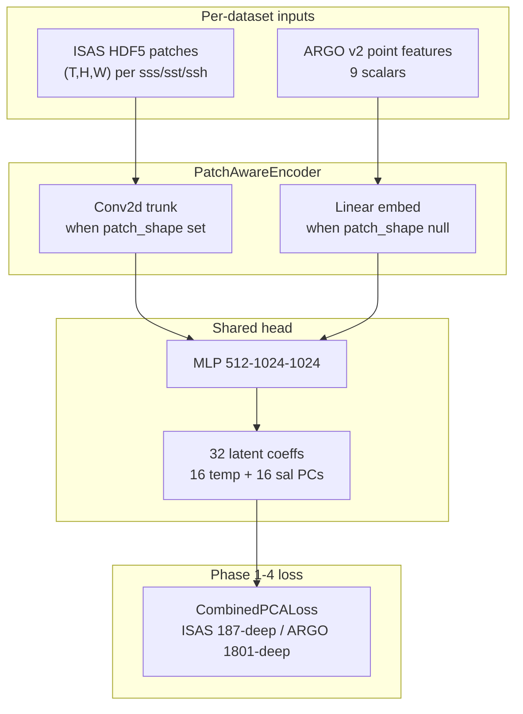
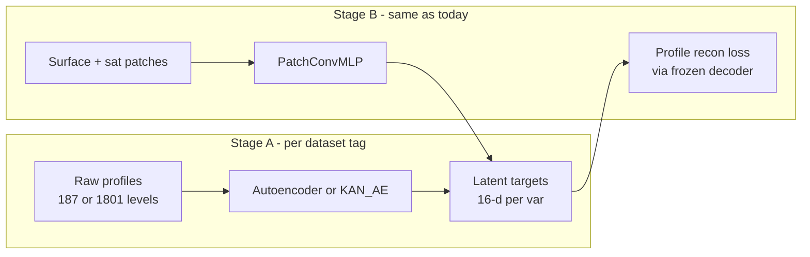

# Patch-Aware Architecture + ML Opt Handoff

**Saved:** 2026-06-17  
**Branch:** `nespreso-v2-port` (per git status at session start)  
**Status:** ML optimization benchmark **done**; patch architecture plan **not started**

---

## Session handoff (read this first)

### What was completed this session

| Deliverable | Location |
|---|---|
| ML optimization benchmark harness | [`NeSPReSO2_onTemplate/scripts/benchmark_ml_opts.py`](NeSPReSO2_onTemplate/scripts/benchmark_ml_opts.py) |
| Launch wrapper | [`NeSPReSO2_onTemplate/scripts/launch_benchmark.sh`](NeSPReSO2_onTemplate/scripts/launch_benchmark.sh) |
| Performance knobs module | [`NeSPReSO2_onTemplate/playground/performance.py`](NeSPReSO2_onTemplate/playground/performance.py) |
| Optional `performance` config block wired into train | [`train.py`](NeSPReSO2_onTemplate/train.py), [`trainer/trainer.py`](NeSPReSO2_onTemplate/trainer/trainer.py) |
| Benchmark results + applicability table | [`NeSPReSO2_onTemplate/README.md`](NeSPReSO2_onTemplate/README.md) (ML optimization section) |
| Result JSONs | `NeSPReSO2_onTemplate/saved/benchmarks/ml_opts_isas_full.json`, `ml_opts_argo_full.json`, `ml_opts_ddp_isas.json` |

### What is NOT done (next session starts here)

All items below are **pending** — see roadmap Phases 1–5.

- [ ] Fix `compute_input_dim()` — currently **ignores** `spatial_pad` / `temporal_pad` (will break patch training silently)
- [ ] Bump to **16 PCs per variable** (`output_dim=32`); ARGO cache must **refit PCA**, not reuse v2's 15-PC models
- [ ] Implement `PatchConvMLP` (conv branch ISAS, point branch ARGO)
- [ ] Add `config_isas_patch.json` (`spatial_pad=2`, `temporal_pad=3`)
- [ ] Re-benchmark opts on new arch with forward/loss timing split
- [ ] Phase 5 (later): AE / KAN_Autoencoder as learned latent spaces replacing PCA

### Brutally honest takeaways

1. **The current model is too small to care about GPU tricks.** `PredictionModel` (9→512→512→30, ~283K params) ran **~6–7 batches/epoch** on GoM. Every single-GPU optimization we tested was **neutral or slower** than FP32 baseline. Do not expect `autocast`, `torch.compile`, or `matmul_precision` to help until the forward pass is a real fraction of wall time.

2. **The bottleneck is the loss, not the MLP.** Profiler shows top CUDA time in **`Adam.step`** and **`aten::mm`** from PCA profile reconstruction — especially on ARGO (1801 depth levels). Bigger models on ISAS may help; on ARGO you're mostly optimizing sklearn-inverse-shaped matmuls unless you compile the loss path separately.

3. **DDP is the only clear win at current scale** — ~1.39× per epoch on ISAS smoke (2 GPU). But that's because each rank sees half the batches, not because the model is compute-heavy. DDP only becomes essential at **global scale** (~881K stations in v1 global logs).

4. **Flash attention, ZeRO, tensor parallelism, quantization, KV-cache:** wrong problem. This is tabular regression with PCA loss, not an LLM.

5. **16 components instead of 15** is a legitimate basis change, not a hack — but it **breaks v2 equivalence** (`selfcheck.py` pins), requires **loss scale re-derivation**, and forces **new cache pickles** for both dataset tags. Budget time for that; don't hand-wave it.

6. **Patch inputs are wired in preproc but not safe to enable yet** because `train.py` overwrites `input_dim` from the broken `compute_input_dim()`. Turning on `spatial_pad>0` today would train a 9-input model on 306-dim data.

7. **AE/KAN as PCA replacement is interesting science, not a speed fix.** Defer until PatchConvMLP + PCA-16 works. KAN splines are expensive; you'll trade PCA simplicity for training surface area.

8. **Don't chase optimization benchmarks on GoM.** If the goal is faster training, scale data (global ISAS, larger BBox) or reduce epoch count / early-stop patience before tuning kernels.

### Recommendations (priority order)

1. **Phase 1 first, no shortcuts:** fix `compute_input_dim`, store patch metadata in cache, add 16+16 PCA with ARGO refit. Run `selfcheck.py` after.
2. **Then PatchConvMLP** with ISAS `spatial_pad=2, temporal_pad=3` and ARGO point mode — one model class, twin configs.
3. **Re-run benchmark** with `--forward-only` timing (to add) before claiming GPU wins.
4. **Enable `performance` block only if benchmark proves >10% on forward pass** — default stays FP32.
5. **Phase 5 (AE/KAN)** only after eval RMSE with PCA-16 patch model is acceptable vs current 15-PC point baseline.

### Quick commands for next session

```bash
cd NeSPReSO2_onTemplate

# Verify port still healthy
srun --ntasks=1 --cpus-per-task=8 python3 selfcheck.py

# Re-run ML opt sweep (already implemented)
srun --ntasks=1 --cpus-per-task=8 --gres=gpu:1 \
  python3 scripts/benchmark_ml_opts.py -c config_isas.json --profile

# After Phase 1: rebuild caches
srun --ntasks=1 --cpus-per-task=8 python3 preproc/preproc_isas_sat.py cache config_isas_patch.json --force
srun --ntasks=1 --cpus-per-task=8 python3 preproc/export_v2_cache.py -c config_argo.json --force
```

---

## Roadmap todos

| ID | Status | Task |
|---|---|---|
| `fix-input-dim` | pending | Fix `compute_input_dim`; patch metadata in cache; selfcheck validation |
| `pca-16-components` | pending | 16 PCs per var; ARGO PCA refit; loss scales; new selfcheck pins |
| `implement-patch-conv-mlp` | pending | `PatchConvMLP` in `model/model.py` |
| `patch-configs` | pending | `config_isas_patch.json` + twin ARGO config |
| `rebenchmark-arch` | pending | Extend benchmark for new arch + forward/loss split |
| `run-compare-document` | pending | Train smoke, benchmark, README update |
| `ae-kan-latent-roadmap` | pending | Phase 5: AE/KAN latent spaces vs PCA-16 |

---

# Patch-Aware Architecture for GPU Optimization Gains

## Research summary

### Why the current model does not benefit

The production [`PredictionModel`](NeSPReSO2_onTemplate/model/model.py) (`9→512→512→30`, ~283K params) is too small and too fast per step for the optimizations we benchmarked. Profiler data (`saved/benchmarks/ml_opts_isas_full.json`) shows **CUDA time in `Adam.step` and PCA-loss `aten::mm`**, not MLP forward. With only **~6–7 batches/epoch** on GoM, kernel-tuning overhead often exceeds savings.

To make `autocast`, `matmul_precision`, `torch.compile`, and `fused Adam` matter, we need **more forward-pass matmul/conv FLOPs per step** and/or **more steps per epoch** (larger N or smaller effective batch under DDP).

### Measured ML opt results (Jun 2026, already run)

**ISAS** — baseline `0.0256 s/epoch`; best single-GPU variant was baseline itself (1.00×). `autocast_bf16` was 0.82×.

**ARGO** — baseline `0.0214 s/epoch`; `matmul_highest` / `fused_adam` ~1.01× (noise).

**DDP 2-GPU** — `0.0184 s/epoch` vs `0.0256` 1-GPU (~1.39× faster per epoch).

### Architectures in repo (fit for surface → PCA regression)

| Architecture | Task fit | Opt benefit | Dual-dataset ready? |
|---|---|---|---|
| [`PredictionModel`](NeSPReSO2_onTemplate/model/model.py) / `FFNN` | **Yes** (current v2 path) | **Low** (~283K params) | Yes (config `input_dim`) |
| **Scaled `PredictionModel` on patch vectors** | **Yes** | **Medium–High** (3–15M+ params) | Yes, with pad-aware `input_dim` fix |
| **`PatchConvMLP` (recommended, Phase 1–4)** | **Yes** — uses spatial/temporal sat context | **High** (conv + large linear) | Yes — point branch for ARGO, conv branch for ISAS |
| `Autoencoder` / `KAN_Autoencoder` | **Phase 5** — learned latent space **replacing PCA** | Medium–High (wider encoder/decoder) | Yes, after latent-training pipeline exists |
| Transformer + flash attention | Possible but overkill | Low at GoM scale (~12–100 tokens) | Possible, more plumbing |
| v2 `VAE` / playground `DIRESA` | Different pipeline (TF/Keras) | Not integrated | No |

### Input datasets / patch pipeline (already in repo)

The satellite patch pipeline is **ready** in [`preproc/preproc_isas_sat.py`](NeSPReSO2_onTemplate/preproc/preproc_isas_sat.py):

- `extract_sat_values()` handles `(N,T,H,W)` HDF5 slices → flattened patch or center pixel
- Legacy defaults: `spatial_pad=2`, `temporal_pad=3` → **5×5 spatial × 4 time × 3 vars + 6 encodings = 306 features**
- GoM ISAS HDF5 already stores **7×33×33** patches per variable — can also use `spatial_pad=16` (full grid)
- v1 global path exists via legacy `preprocess_data()` + [`preproc_isas_confiv.json`](NeSPReSO2_onTemplate/preproc/preproc_isas_confiv.json) (881K stations; throughput play)
- ARGO [`export_v2_cache.py`](NeSPReSO2_onTemplate/preproc/export_v2_cache.py) exports **point inputs** from v2 pickle (~9 dims today); patches not required for dual-dataset parity

**Blocker discovered:** [`compute_input_dim()`](NeSPReSO2_onTemplate/preproc/preproc_isas_sat.py) only counts feature flags and **ignores `spatial_pad` / `temporal_pad`**. [`train.py`](NeSPReSO2_onTemplate/train.py) overwrites `arch.input_dim` with this value, so enabling patches would silently mismatch model vs cache. This must be fixed before any patch experiment.



---

## Recommendation: `PatchConvMLP` + patch-enabled ISAS configs

**Best balance of constraints** (leverage patch pipeline, train both datasets with minimal changes, pursue throughput):

### Architecture

Add [`PatchConvMLP`](NeSPReSO2_onTemplate/model/model.py) (name flexible):

1. **Encoding branch (6 dims):** time/lat/lon sin/cos → small linear → `d_model` (64–128)
2. **Satellite branch (mode-dependent):**
   - **Point mode** (`spatial_pad=0`): 3 scalars → linear → `d_model` (ARGO + ISAS point baseline)
   - **Patch mode** (`spatial_pad>0`): reshape flattened sat block to `(B, 3, T, H, W)` using cache metadata → `Conv2d` stack (e.g. `3→32→64`, kernel 3, GAP) → linear → `d_model`
3. **Fusion:** concat or add encoding + sat embeddings
4. **Head:** `Linear(d_model → 1024 → 1024 → 32)` with dropout 0.2 — **16 PCs per variable** (`output_dim = 32`)
5. **Parameter target:** ~2–8M params (10–30× current) — enough for `autocast`/`compile`/`matmul_high` to show gains on forward pass

### Latent dimension: 16 + 16 (power-of-2 via `n_components`, not padding)

Instead of padding 15→16 with dummy coefficients, set in both twin configs:

```json
"outputs": { "temperature": 16, "salinity": 16 },
"arch": { "args": { "output_dim": 32 } }
```

**Why:** `output_dim=32` and per-variable `n_components=16` are powers of 2, which can help GPU matmul tiling in the PCA inverse (`pcs @ components`) without artificial features. This is a real basis change, not zero-padding.

**Caveats (must handle in implementation):**
- ISAS: PCA refit in [`build_train_cache()`](NeSPReSO2_onTemplate/preproc/preproc_isas_sat.py) — straightforward
- ARGO: v2 pickle ships **15-component** sklearn PCA today; [`export_v2_cache.py`](NeSPReSO2_onTemplate/preproc/export_v2_cache.py) must **refit PCA to 16** from stored profiles (or add a `refit_pca: true` flag) rather than reusing v2's 15-PC models
- GoM loss scales in [`model/loss.py`](NeSPReSO2_onTemplate/model/loss.py) (`DEFAULT_*`) were tuned for 15 PCs — **re-derive or re-fit** after switching to 16
- `selfcheck.py` forward/loss pins and v2 equivalence tests need new baseline (15-PC v2 parity is intentionally broken when n_components changes)
- `config_hash` changes → new cache pickles for both tags

**Why this beats a fat flat MLP on patches:** ISAS patches have **2D spatial structure**; conv exploits it with fewer params than `306→2048` linear. Conv layers benefit from `cudnn.benchmark` and mixed precision more than tiny MLPs.

**Why not flash attention:** token count is small (T×H×W at most 7×33×33 per var); conv is the right inductive bias.

### Dataset configs (minimal divergence)

Keep twin-config pattern; only change `io` pads on ISAS:

| Config | `spatial_pad` | `temporal_pad` | Approx `input_dim` | Encoder mode |
|---|---:|---:|---:|---|
| `config_isas_patch.json` (new) | **2** | **3** | 306 flat / structured patch | Conv branch |
| [`config_argo.json`](NeSPReSO2_onTemplate/config_argo.json) | 0 | 0 | 9 | Point branch |
| Future ISAS-global | 0–16 | 0–6 | varies | Conv if pads > 0 |

Same `CombinedPCALoss` (with 16+16 PCA bases), `outputs`, split seed, trainer, eval scripts — **no ARGO code fork**.

Apply the **16+16 PC change to both** patch configs so dual-dataset comparison stays fair.

### Throughput path

1. **Near term (GoM ~5K profiles):** DDP (~1.39× seen already) + optional `performance.compile` on `PatchConvMLP`
2. **Medium term:** ISAS v1 global or larger BBox → many more batches/epoch; DDP + fused Adam + autocast become essential
3. **ARGO note:** 1801-level PCA inverse in loss will still dominate unless batch size grows or loss is compiled separately — do not expect ARGO to show the same forward-pass speedup as ISAS patch runs

---

## Implementation plan

### Phase 1 — Unblock patch inputs + 16-component PCA

| Task | File |
|---|---|
| Extend `compute_input_dim(input_params, spatial_pad, temporal_pad, n_sat_vars=3)` | [`preproc/preproc_isas_sat.py`](NeSPReSO2_onTemplate/preproc/preproc_isas_sat.py) |
| Pass `io.spatial_pad` / `io.temporal_pad` from config in `train.py` + cache validation | [`train.py`](NeSPReSO2_onTemplate/train.py) |
| Store `spatial_pad`, `temporal_pad`, `sat_patch_shape` in cache payload | [`preproc/preproc_isas_sat.py`](NeSPReSO2_onTemplate/preproc/preproc_isas_sat.py) |
| Set `outputs: {temperature: 16, salinity: 16}`, `output_dim: 32` in patch configs | `config_isas_patch.json`, `config_argo.json` |
| ARGO cache: refit sklearn PCA to 16 components from profiles | [`preproc/export_v2_cache.py`](NeSPReSO2_onTemplate/preproc/export_v2_cache.py) |
| Re-derive or config-drive loss scales for 16-PC bases | [`model/loss.py`](NeSPReSO2_onTemplate/model/loss.py) or config JSON |
| Assert `cache inputs.shape[1] == model.input_dim` after cache build | [`selfcheck.py`](NeSPReSO2_onTemplate/selfcheck.py) |

### Phase 2 — `PatchConvMLP` model

| Task | File |
|---|---|
| Implement `PatchConvMLP(BaseModel)` with `point` / `patch` modes from config args | [`model/model.py`](NeSPReSO2_onTemplate/model/model.py) |
| Config args: `d_model`, `head_layers`, `conv_channels`, `patch_shape` (or derive from `io` pads) | new `config_isas_patch.json`, `config_argo.json` (arch type only) |
| Forward equivalence test: point mode with `pad=0` matches `PredictionModel` within tolerance | [`selfcheck.py`](NeSPReSO2_onTemplate/selfcheck.py) |

### Phase 3 — Re-benchmark optimizations on the new architecture

Extend [`scripts/benchmark_ml_opts.py`](NeSPReSO2_onTemplate/scripts/benchmark_ml_opts.py):

- Add `--arch PatchConvMLP` and ISAS patch config
- Compare **baseline FP32 vs combo_best** for:
  - `PredictionModel` 9-dim (current)
  - `PatchConvMLP` ISAS patch
  - `PatchConvMLP` ARGO point
- Report **forward-only** timing (optional flag) to separate model gains from PCA-loss `aten::mm`

Expected outcome: ISAS patch conv model shows **largest speedup** from `autocast`/`compile`/`matmul_high`; ARGO point mode remains loss-dominated; DDP helps both when scaling N.

### Phase 4 — Optional throughput scale-up

- Add `config_isas_global.json` pointing at v1 global HDF5 + legacy richer `input_params` (wind, bathymetry) when data is available on host
- Train with DDP + `performance` block enabled; compare wall-clock to dual GoM runs

### Phase 5 — Learned latent spaces (post-roadmap; explore AE / KAN alternatives to PCA)

**Goal:** Replace fixed sklearn PCA with a **learned profile encoder** as the objective representation space, while keeping the surface → latent → profile reconstruction training pattern.

**Candidates already in repo:**
- [`Autoencoder`](NeSPReSO2_onTemplate/model/model.py) — classic MLP encoder/decoder on depth profiles (ISAS 187 / ARGO 1801)
- [`KAN_Autoencoder`](NeSPReSO2_onTemplate/model/model.py) — spline-based encoder/decoder; playground benchmarks in [`playground/test_autoencoders*.py`](NeSPReSO2_onTemplate/playground/)
- Prior art: playground [`test_diresa_vs_autoencoder.py`](NeSPReSO2_onTemplate/playground/test_diresa_vs_autoencoder.py) (DIRESA comparison; TF dep — reference only)

**Proposed two-stage pipeline (not in Phase 1–4 scope):**



| Step | Work |
|---|---|
| A1 | Train/freeze profile AE per cache tag (mask-aware for NaN levels); target `encoding_dim=16` per variable |
| A2 | Export latent targets into train cache (replace PCA `targets` + `pca_models`) |
| A3 | Swap `CombinedPCALoss` for **decoder-based profile loss** (reuse `torch_reconstruct_profile` pattern with learned decoder weights) |
| A4 | Compare eval RMSE: PCA-16 vs AE-16 vs KAN-16 on ISAS and ARGO |
| A5 | Re-run ML opt benchmarks — AE decoder matmuls at 16-dim latent may benefit more from `autocast`/`compile` than sklearn PCA path |

**Defer until:** PatchConvMLP + 16-PC PCA path is stable and benchmarked (Phases 1–4). AE/KAN adds training complexity (masking, depth-grid differences ISAS vs ARGO, per-tag decoders).

---

## What we would **not** pursue

- **Flash attention / KV-cache / quantization** — no autoregressive or LLM inference path
- **ZeRO / tensor parallelism** — model still fits in VRAM even at 8M params
- **Porting DIRESA/VAE wholesale** — TF dependency, different objective; not minimal-change dual-dataset
- **Zero-padding PCA coefficients** (15→16 with dummy dims) — superseded by **`n_components=16` per variable** (real PCA refit)

---

## Success criteria

1. ISAS patch + ARGO point train end-to-end with **one model class**, **32-d latent output (16+16 PCs)**, and existing eval path
2. `PatchConvMLP` ISAS run shows **measurable forward-pass speedup** (target: >10%) from at least one of `autocast_bf16`, `matmul_high`, or `compile` in benchmark harness
3. `eval_run.py` val/test RMSE **not worse** than current `PredictionModel` 15-PC point baseline on ISAS (acknowledge basis change; compare within 16-PC regime)
4. `selfcheck.py` passes with updated 16-PC pins
5. **(Phase 5, later)** AE/KAN latent prototype documented with go/no-go vs PCA-16 on at least ISAS tag

---

## Related docs

| Doc | Purpose |
|---|---|
| [`PLAN.md`](PLAN.md) | Original v2 port + dual-dataset plan (Phases 0–7 done) |
| [`PLAN-agent-train-monitor.md`](PLAN-agent-train-monitor.md) | Agent dual-run monitoring |
| [`SOURCES.md`](SOURCES.md) | v2 module mapping |
| [`NeSPReSO2_onTemplate/README.md`](NeSPReSO2_onTemplate/README.md) | Ops + ML benchmark results |
