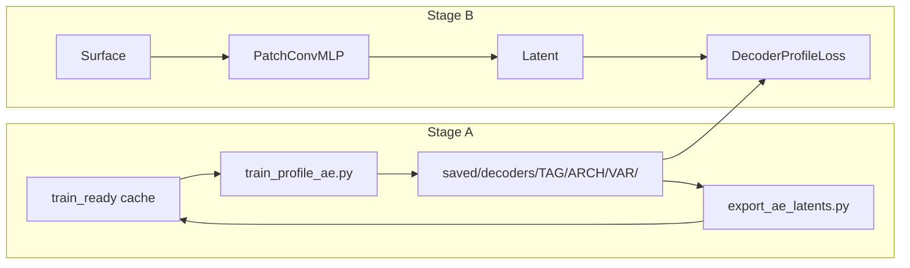

# Phase 5 — Learned Latent (AE / KAN) vs PCA-16

**Branch:** `nespreso-v2-port`  
**Status:** **Stage B in flight (ISAS)** — go/no-go **failed** on dim16/dim32 test RMSE; `decoder32_res_ae` last hope  
**Gate cleared:** Phase 4 ISAS eval signed off; Phase 4b exhausted

---

## Goal

Replace sklearn PCA profile inverse in the training loss with a **frozen learned decoder**, keeping surface → latent → profile reconstruction.

**Speed hypothesis (honest):** Might matter on ARGO (1801 levels). ISAS benchmark showed decoder loss ~3% *slower* than PCA at dim16 — **not a win at GoM scale.**

**Science hypothesis:** AE salinity recon beats PCA at equal bottleneck — **true in Stage A, false in Stage B** so far.

---

## Pipeline



| Step | Task | Status |
|------|------|--------|
| A1 | Profile AE per tag × variable | **done** — Autoencoder, ResAutoencoder, layer-scale |
| A2 | Export AE latents to cache | **done** — `ae_targets`, `ae_targets_dim32`, `ae_targets_dim32_res` |
| A3 | `DecoderProfileLoss`; `loss_config.mode: decoder` | **done** |
| A4 | Eval vs PCA test RMSE | **done (ISAS)** — **all runs fail 5% gate** |
| A5 | Full-step speed benchmark (ARGO) | **not re-run** |
| — | Residual / skip connections | **done** — `ResAutoencoder`, `PatchConvMLP(residual=True)` |
| — | 2× capacity sweep (dim32 MLP + AE) | **done** — val_loss better, test RMSE still bad |

---

## Session results (2026-06-18)

### Stage A — profile recon (ISAS, 187 levels, val split)

| Arch | dim | T recon | S recon | Notes |
|------|----:|--------:|--------:|-------|
| PCA-16 | 16 | 0.291 | 1.169 | baseline |
| Autoencoder | 16 | 0.350 | **0.208** | original Stage A |
| Autoencoder | 32, 2× layers | 0.327 | 0.207 | more params, marginal |
| **ResAutoencoder** | 32, 2× layers | **0.202** | **0.181** | **best Stage A** — residual hidden blocks |

Salinity AE recon is real. Temperature AE still loses to PCA even with residuals.

### Stage B — test `raw_profile_rmse` (758 test profiles, cache `e6f936bdc80a`)

| Run | MLP params | best val_loss | T RMSE | S RMSE | vs PCA |
|-----|----------:|--------------:|-------:|-------:|--------|
| PCA-16 prod | 1.24M | — | **1.016** | **5.318** | — |
| decoder16_ae | 1.24M | 0.566 | 1.314 | 7.078 | **fail** |
| decoder32_ae | 4.96M | 0.488 | 1.287 | 6.416 | **fail** |
| decoder32_res_ae | 5.68M | ~0.61 @ ep70 | — | — | **running** |

**Brutal take:** Lower val_loss ≠ better profiles. The surface model is not learning AE latents well enough; frozen decoder amplifies latent error. Doubling capacity moved salinity RMSE ~10% toward PCA, not to parity.

### Training curves

`saved/plots/decoder16_vs_decoder32_train_curves.png` — dim32 reaches lower val_loss in ~⅓ the epochs of dim16. Generalization gap (val_loss vs test profile RMSE) is large.

### ISAS speed (dim16, full step)

| Mode | sec/epoch | vs PCA |
|------|----------:|-------:|
| PCA combined | 0.0306 | 1.00× |
| Decoder loss | 0.0314 | 0.97× (~3% slower) |

---

## Go/no-go criteria

1. **RMSE:** test profile RMSE not &gt;5% worse than PCA per variable → **FAILED** (dim16, dim32).
2. **Speed:** ≥10% faster full step on ARGO → **not demonstrated**; ISAS slightly slower.
3. **Production call:** **Keep PCA-16** unless `decoder32_res_ae` clears the RMSE gate. Treat AE as science appendix if it fails.

---

## Architecture notes (residual)

- **ResAutoencoder:** residual linear blocks in encoder/decoder; **no** delta-decode (`x + f(z)`) — breaks Stage B where only `z` is available.
- **PatchConvMLP `residual=True`:** ResNet conv trunk + residual MLP head; enc+sat additive fusion unchanged.
- Checkpoints store `residual`, `encoder_layers`, `decoder_layers`, `layer_scale`.

---

## Known issues

| Issue | Workaround |
|-------|------------|
| `eval_run.py` `loss: NaN` in decoder mode | Use `raw_profile_rmse` only |
| Config hash creates new cache pickle | Pin `cache_path` in decoder configs |
| `latent_target_rmse` meaningless across dims | Compare within same `outputs` dict only |
| Raw salinity NaNs in cache profiles | Training loss uses `true_profiles_numpy()` (PCA recon), not raw profiles |

---

## Recommendations

1. Finish `decoder32_res_ae`; eval at convergence. If fail → **close Phase 5 for ISAS**.
2. Before more ISAS tuning: diagnose **latent prediction quality** (AE-latent RMSE on test, per-variable) — is the bottleneck surface→latent or decoder?
3. ARGO: only tag worth a speed benchmark; only if still pursuing decoder for perf, not science.
4. Optional experiment: train surface head on **PCA latents**, eval profile RMSE via **AE decode** — separates latent-target choice from surface training.

---

## Quick commands

```bash
cd NeSPReSO2_onTemplate

# ResAutoencoder Stage A
srun --ntasks=1 --cpus-per-task=8 --gres=gpu:1 \
  python3 scripts/train_profile_ae.py -c config_isas_patch.json \
  --arch ResAutoencoder --encoding-dim 32 --layer-scale 2 \
  --arch-tag ResAutoencoder_dim32

# Export + Stage B
srun --ntasks=1 --cpus-per-task=8 --gres=gpu:1 \
  python3 scripts/export_ae_latents.py \
  -c config_isas_patch_decoder_dim32_res.json \
  --cache ../data/cache/train_ready_e6f936bdc80a.pkl \
  --decoder-dir saved/decoders/isas20/ResAutoencoder_dim32 \
  --target-key ae_targets_dim32_res --weight-key ae_weights_dim32_res

srun --ntasks=1 --cpus-per-task=8 --gres=gpu:1 \
  python3 train.py -c config_isas_patch_decoder_dim32_res.json -id decoder32_res_ae

srun --ntasks=1 --cpus-per-task=8 --gres=gpu:1 \
  python3 eval_run.py -c config_isas_patch_decoder_dim32.json \
  -r saved/models/NeSPReSO2_ISAS_GoM_patch_decoder_dim32/decoder32_ae/model_best.pth \
  --out saved/eval_isas_decoder32_test.json
```

---

## Related

| Doc | Purpose |
|-----|---------|
| [HANDOFF.md](HANDOFF.md) | Live status, active runs |
| [PLAN-patch-arch-handoff.md](PLAN-patch-arch-handoff.md) | Phases 1–4b |
