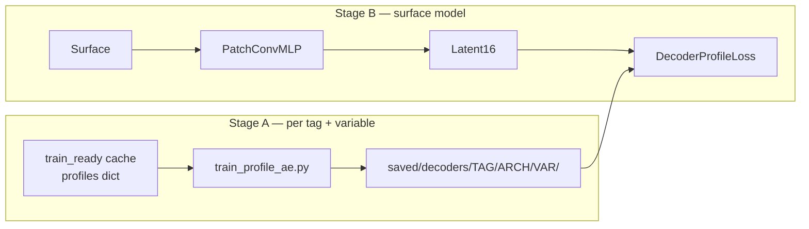

# Phase 5 — Learned Latent (AE / KAN) vs PCA-16

**Branch:** `nespreso-v2-port`  
**Status:** **in progress** (Stage A started)  
**Gate cleared:** Phase 4 ISAS eval signed off; Phase 4b exhausted (&lt;10% on batch, compile_loss, pred_profile_cached)

---

## Goal

Replace sklearn PCA profile inverse in the training loss with a **frozen learned decoder** (16-d latent → full-depth profile), while keeping the surface → latent → profile reconstruction pattern.

**Speed hypothesis (honest):** A compiled MLP decoder *might* beat four PCA inverses/step on ARGO (1801 levels). KAN splines may be slower. Treat speed as benchmark-gated, not promised.

**Science hypothesis:** AE-16 may match or beat PCA-16 profile RMSE when trained mask-aware on NaN salinity (ISAS).

---

## Two-stage pipeline



| Step | Task | Status |
|---|---|---|
| A1 | Train/freeze profile AE per tag × variable (`encoding_dim=16`) | **in progress** — `scripts/train_profile_ae.py` |
| A2 | Export AE latent targets into cache (optional; can use `model.encode`) | pending |
| A3 | `DecoderProfileLoss` in `model/loss.py`; `loss_config.mode: decoder` | pending |
| A4 | Eval RMSE: PCA-16 vs AE-16 vs KAN-16 (ISAS + ARGO) | pending |
| A5 | `benchmark_ml_opts.py` full-step — speed win only if ≥10% | pending |

---

## Go/no-go criteria

1. **RMSE:** AE-16 test profile RMSE not worse than PCA-16 by &gt;5% on either variable (per tag).
2. **Speed:** Full training step ≥10% faster than `CombinedPCALoss` + PCA inverse on ARGO.
3. If either fails, **keep PCA-16** for production; document AE as science appendix.

---

## Quick commands

```bash
cd NeSPReSO2_onTemplate

# Stage A — train decoders (mask-aware MSE)
srun --ntasks=1 --cpus-per-task=8 --gres=gpu:1 \
  python3 scripts/train_profile_ae.py -c config_argo.json --arch Autoencoder

srun --ntasks=1 --cpus-per-task=8 --gres=gpu:1 \
  python3 scripts/train_profile_ae.py -c config_isas_patch.json --arch Autoencoder

# Compare AE recon RMSE vs PCA on held-out profiles (printed at end of train_profile_ae.py)
```

---

## Related

| Doc | Purpose |
|---|---|
| [PLAN-patch-arch-handoff.md](PLAN-patch-arch-handoff.md) | Phases 1–4b complete |
| [NeSPReSO2_onTemplate/playground/test_autoencoders.py](NeSPReSO2_onTemplate/playground/test_autoencoders.py) | Prior AE experiments (ISAS-oriented) |
