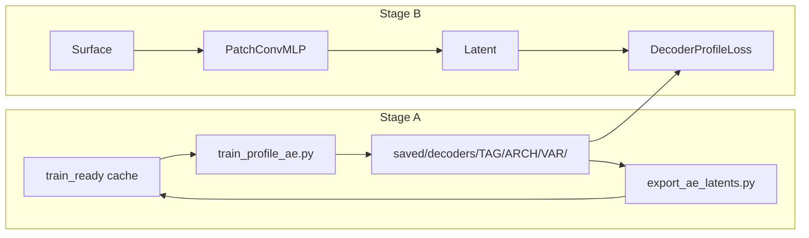

# Phase 5 — Learned Latent (AE / KAN) vs PCA-16

**Branch:** `nespreso-v2-port`  
**Status:** **CLOSED (ISAS production)** — keep PCA-16; AE/decoder pipeline retained as science appendix  
**Gate cleared:** Phase 4 ISAS eval signed off; Phase 4b exhausted

---

## Goal

Replace sklearn PCA profile inverse in the training loss with a **frozen learned decoder**, keeping surface → latent → profile reconstruction.

**Speed hypothesis:** Might matter on ARGO (1801 levels). ISAS showed decoder loss ~3% *slower* than PCA — **not a win at GoM scale.**

**Science hypothesis:** AE salinity recon beats PCA at equal bottleneck — **true in Stage A, false in Stage B.**

---

## Pipeline

| Step | Task | Status |
|------|------|--------|
| A1 | Profile AE per tag × variable | **done** |
| A2 | Export AE latents to cache | **done** |
| A3 | `DecoderProfileLoss`; `mode: decoder` | **done** |
| A4 | Eval vs PCA test RMSE | **done** — **all converged runs fail 5% gate** |
| A5 | Full-step speed benchmark (ARGO) | **not run** — deferred |
| — | Residual blocks + surface SST/SSS skip | **done** — not pursued past smoke |
| — | dim32 capacity sweep | **done** — val_loss better, test RMSE still bad |

---

## Final results (ISAS, cache `e6f936bdc80a`, 758 test profiles)

### Stage A — profile recon (val split, 187 levels)

| Arch | dim | T recon | S recon | Notes |
|------|----:|--------:|--------:|-------|
| PCA-16 | 16 | 0.291 | 1.169 | baseline |
| **ResAutoencoder** | 32, 2× layers | **0.202** | **0.181** | best Stage A (hidden residual blocks) |
| ResAutoencoder_satres | 32, 2× layers | 0.394 | 0.508 | SST/SSS decode skip — Stage A regressed |

### Stage B — test `raw_profile_rmse`

| Run | best val_loss | T RMSE | S RMSE | vs PCA | Notes |
|-----|--------------:|-------:|-------:|--------|-------|
| **PCA-16 prod** | — | **1.016** | **5.318** | — | production |
| decoder16_ae | 0.566 | 1.314 | 7.078 | **fail** | converged |
| decoder32_ae | 0.483 | 1.287 | 6.416 | **fail** | converged |
| decoder32_res_ae | 0.581 | 26.45 | 31.37 | **fail** | **abandoned @ ep 138** — immature |
| decoder32_satres_2ep | 13.28 @ ep1 | — | — | — | 2-epoch wiring smoke only |

Eval JSON: `saved/eval_isas_decoder{16,32,32_res}_test.json`

---

## Go/no-go (final)

| Criterion | Result |
|-----------|--------|
| RMSE within 5% of PCA | **FAILED** (dim16, dim32) |
| ARGO speed ≥10% | **Not demonstrated** |
| **Production call** | **Keep PCA-16** (`patch16_scales`) |

---

## Why it failed

1. **Bottleneck is surface → latent**, not profile inverse. AE latents are harder to predict than PCA components from the same surface inputs.
2. **val_loss ≠ profile quality** — large generalization gap between AE-latent MSE and `raw_profile_rmse`.
3. **Capacity did not fix it** — dim32 and residual MLP moved salinity ~10% toward PCA, not to parity.
4. **Surface-residual skip** — correct for Stage B (SST/SSS available at decode), but regressed Stage A and was not worth a full ISAS sweep.

---

## Architecture notes

- **ResAutoencoder:** residual linear blocks in encoder/decoder.
- **Surface-residual decode:** `decode(z) + broadcast(SST|SSS)` from center sat patch; wired in `DecoderProfileLoss` via batch `inputs`.
- **PatchConvMLP `residual=True`:** ResNet conv trunk + residual MLP head.

---

## Known issues (accepted for appendix)

| Issue | Workaround |
|-------|------------|
| `eval_run.py` `loss: NaN` in decoder mode | Use `raw_profile_rmse` only |
| Config hash creates new cache pickle | Pin `cache_path` in decoder configs |
| `latent_target_rmse` meaningless across dims | Ignore for cross-run comparison |

---

## Optional future work (not scheduled)

1. **ARGO speed benchmark** — only tag where decoder inverse might help perf.
2. **PCA-latent train + AE decode eval** — diagnostic for latent-target choice.
3. **Joint decoder fine-tune** — only with a new hypothesis.

---

## Related

| Doc | Purpose |
|-----|---------|
| [HANDOFF.md](HANDOFF.md) | Live status, production pointer |
| [PLAN-patch-arch-handoff.md](PLAN-patch-arch-handoff.md) | Phases 1–4b |
