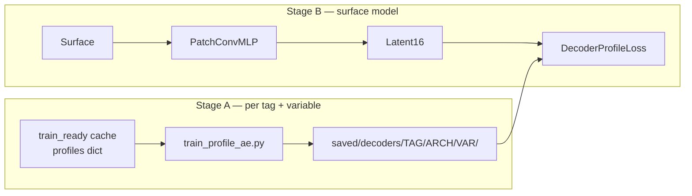

# Phase 5 — Learned Latent (AE / KAN) vs PCA-16

**Branch:** `nespreso-v2-port`  
**Status:** **paused** — notebook comparison rewrite is current eval surface; Stage B blocked on go/no-go (see [HANDOFF.md](HANDOFF.md))  
**Gate cleared:** Phase 4 ISAS eval signed off; Phase 4b exhausted (&lt;10% on batch, compile_loss, pred_profile_cached)

---

## Goal

Replace sklearn PCA profile inverse in the training loss with a **frozen learned decoder** (16-d latent → full-depth profile), while keeping the surface → latent → profile reconstruction pattern.

**Speed hypothesis (honest):** A compiled MLP decoder *might* beat four PCA inverses/step on ARGO (1801 levels). KAN splines may be slower. Treat speed as benchmark-gated, not promised.

**Science hypothesis:** AE-16 may match or beat PCA-16 profile RMSE when trained mask-aware on NaN salinity (ISAS).

---

## Two-stage pipeline



| Step | Task | Status |
|---|---|---|
| A1 | Train/freeze profile AE per tag × variable (`encoding_dim=16`) | **dim sweep done** — `scripts/train_profile_ae.py`, `scripts/benchmark_profile_ae_dims.py` |
| A2 | Export AE latent targets into cache (optional; can use `model.encode`) | pending |
| A3 | `DecoderProfileLoss` in `model/loss.py`; `loss_config.mode: decoder` | pending |
| A4 | Eval RMSE: PCA-16 vs AE-16 vs KAN-16 (ISAS + ARGO) | pending |
| A5 | `benchmark_ml_opts.py` full-step — speed win only if ≥10% | pending |

### Stage A AE dimension sweep (GoM, Autoencoder, 200 epochs, dims 16–256)

Compared to **PCA-X** at matching X (fair bottleneck). JSON: `saved/benchmarks/ae_dims_*_Autoencoder.json`.

**ISAS (`isas20`, 187 levels)**

| dim | temp PCA | temp AE | sal PCA | sal AE | sal winner |
|---:|---:|---:|---:|---:|---|
| 16 | 0.291 | 0.476 | 1.169 | **0.256** | AE |
| 32 | 0.291 | 0.478 | 1.169 | **0.263** | AE |
| 64 | 0.291 | 0.493 | 1.169 | **0.433** | AE |
| 128 | 0.291 | 0.486 | 1.169 | **0.202** | AE (best sal) |
| 256 | 0.291 | 0.471 | 1.169 | **0.278** | AE |

**ARGO (`argo_v2`, 1801 levels)** — PCA wins every cell at 200 epochs; AE needs more capacity/training.

| dim | temp PCA | temp AE | sal PCA | sal AE |
|---:|---:|---:|---:|---:|
| 16 | 0.061 | 0.355 | 0.013 | 0.159 |
| 256 | 0.061 | 0.400 | 0.013 | 0.161 |

*Note: sweep above used PCA-16 for all dims (config cap). Script now uses PCA-X per dim for fair comparison on re-run.*

### Phase 4b combined stack vs baseline (ARGO full step)

| Variant | sec/epoch | vs baseline | batch |
|---|---:|---:|---:|
| baseline | 0.0246 | 1.00× | 512 |
| **combo_phase4b_all** | 0.0272 | **0.90× (~10% slower)** | 2755 |

Stack: max batch + `pred_profile_cached` + `compile(model+loss)`. **Do not enable combined** on GoM — overhead exceeds savings.

---

## Go/no-go criteria

1. **RMSE:** AE-16 test profile RMSE not worse than PCA-16 by &gt;5% on either variable (per tag).
2. **Speed:** Full training step ≥10% faster than `CombinedPCALoss` + PCA inverse on ARGO.
3. If either fails, **keep PCA-16** for production; document AE as science appendix.

---

## Quick commands

```bash
cd NeSPReSO2_onTemplate

# Stage A — train decoders (mask-aware MSE)
srun --ntasks=1 --cpus-per-task=8 --gres=gpu:1 \
  python3 scripts/train_profile_ae.py -c config_argo.json --arch Autoencoder

srun --ntasks=1 --cpus-per-task=8 --gres=gpu:1 \
  python3 scripts/train_profile_ae.py -c config_isas_patch.json --arch Autoencoder

# Compare AE recon RMSE vs PCA on held-out profiles (printed at end of train_profile_ae.py)

# Stage A — sweep encoding dims 16–256 vs PCA-X (fair bottleneck)
srun --ntasks=1 --cpus-per-task=8 --gres=gpu:1 \
  python3 scripts/benchmark_profile_ae_dims.py -c config_isas_patch.json --arch Autoencoder

srun --ntasks=1 --cpus-per-task=8 --gres=gpu:1 \
  python3 scripts/benchmark_profile_ae_dims.py -c config_argo.json --arch Autoencoder

# Phase 4b combined stack vs baseline (ARGO full step)
srun --ntasks=1 --cpus-per-task=8 --gres=gpu:1 \
  python3 scripts/benchmark_ml_opts.py -c config_argo.json --variant combo_phase4b_all
```

---

## Related

| Doc | Purpose |
|---|---|
| [PLAN-patch-arch-handoff.md](PLAN-patch-arch-handoff.md) | Phases 1–4b complete |
| [NeSPReSO2_onTemplate/playground/test_autoencoders.py](NeSPReSO2_onTemplate/playground/test_autoencoders.py) | Prior AE experiments (ISAS-oriented) |
