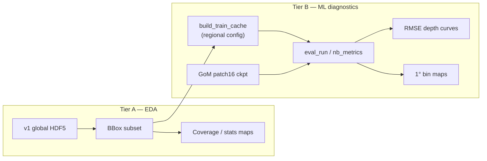

# Phase 6 — Diagnostics, global regional notebook, results narrative

**Branch:** `nespreso-v2-port`  
**Status:** **IN PROGRESS** — Tier A EDA + regional config landed; Tier B blocked on global profiles HDF5  
**Gate cleared:** Phase 5 closed (PCA-16 production); Phase 4b exhausted on GoM

---

## Goal

Use existing eval + notebook infrastructure to **explore global data regionally**, **visualize model behavior** (metrics, depth curves, spatial maps), and **lock in a results narrative** — without reopening architecture sweeps or full-planet training.

**Not the goal:** Another latent/decoder loss iteration, Phase 4b combo on GoM, or headline cross-tag RMSE without `eval_matched.py`.

---

## Production baseline (unchanged)

| Tag | Config | Checkpoint | Test `raw_profile_rmse` |
|-----|--------|------------|-------------------------|
| ISAS GoM | `config_isas_patch.json` | `patch16_scales/model_best.pth` | T **1.016** / S **5.318** |
| ARGO GoM | `config_argo.json` | `argo16_scales/model_best.pth` | T **0.416** / S **0.072** |

Phase 5 AE/decoder code stays as **science appendix** only ([`PLAN-phase5.md`](PLAN-phase5.md)).

---

## Why Phase 6 (honest)

| Track | Effort | Payoff |
|-------|--------|--------|
| Diagnostics / notebooks | Low–medium | **Best ROI now** |
| Global training (old 4c) | High | Only if global *predictions* are required |
| More ML architecture | High | **Low** — Phase 5 showed bottleneck is surface → latent, not profile inverse |
| Hygiene (eval NaN, paths) | Low | Worth doing when touching eval |

```text
DONE              CLOSED           PHASE 6
────              ──────           ───────
Phases 0–4        Phase 5 AE       Regional global notebook
GoM ISAS/ARGO     Phase 4b opts    Results figures + narrative
patch16 prod                       Optional: global train (4c) later
```

---

## Global data (`NeSPReSO_v1_global_sat`)

**On disk (this host):** `data/NeSPReSO_v1_global_sat/` — `satellite_NeSPReSO_v1_global.h5`, `profiles_NeSPReSO_v1_global.h5` (~881K stations in prior notes).

**Reality check:**

- v1 global has **richer** legacy inputs (wind, bathymetry, extra SSH) via [`preproc_isas_confiv.json`](NeSPReSO2_onTemplate/preproc/preproc_isas_confiv.json) — different from GoM v2 patch pipeline.
- GoM checkpoint **≠** global model; regional eval measures **generalization**, not production quality.
- [`preproc_isas_confiv.json`](NeSPReSO2_onTemplate/preproc/preproc_isas_confiv.json) `data_path` is stale (`utils/…`); point new configs at `data/NeSPReSO_v1_global_sat/`.

**Framing:** *Explore global data + plot model behavior regionally* — not *turn on global and get a free upgrade*.

---

## Pipeline (regional notebook)



Reuse: [`nb_metrics.py`](NeSPReSO2_onTemplate/notebooks/nb_metrics.py), [`run_compare.py`](NeSPReSO2_onTemplate/notebooks/run_compare.py), [`compare_v2_vs_template.ipynb`](NeSPReSO2_onTemplate/notebooks/compare_v2_vs_template.ipynb).

**Maps caveat:** notebook may import `nespreso.viz.maps` — verify env or add a small inline bin helper in `nb_metrics`.

---

## Task list

| # | Task | Priority | Notes |
|---|------|----------|-------|
| 6.1 | Add `config_isas_global_*.json` with `io.data_path` + **BBox** (GoM or ~10° box first) | **done** | `config_isas_global_gom.json` — point mode, GoM BBox |
| 6.2 | **Tier A** notebook: station density, SST/SSS coverage, profile stats — no ML | **done** | `scripts/global_eda.py` (headless); notebook optional |
| 6.3 | Regional `build_train_cache` + holdout split | **blocked** | `profiles_NeSPReSO_v1_global.h5` corrupt on host |
| 6.4 | **Tier B**: `nb_metrics` inference with `patch16_scales` on regional test split | **interim** | `scripts/phase6_diagnostics.py` — v2 GoM depth/bin maps; global blocked |
| 6.5 | Extend `nb_configs.py` with `isas_global_regional` smoke key (optional 2-epoch) | **P2** | Mirror `isas_patch` pattern |
| 6.6 | Results section: table from existing `saved/eval_*_test.json` + Phase 5 close-out | **done** | `scripts/results_table.py` → `saved/results/eval_table.md` |
| 6.7 | Fix `eval_run.py` `loss: NaN` in decoder mode (appendix only) | **P3** | Mask-aware or skip combined loss in decoder mode |
| 6.8 | Fix `preproc_isas_confiv.json` path → `data/NeSPReSO_v1_global_sat` | **done** | |
| 6.9 | **Phase 4c** full global train + DDP | **Deferred** | Only after 6.1–6.4 answer “do we need global predictions?” |

---

## Explicitly out of scope (unless question changes)

- Full **881K-station** cache + 8000-epoch train as first global step
- Phase 5 resume (AE decoder, dim32, satres)
- `combo_phase4b_all` on GoM
- Cross-tag RMSE headlines without common grid / `eval_matched.py`
- New dependencies (W&B, MLflow) — JSON + `status.json` + notebook outputs are enough

---

## Optional later: Phase 4c global throughput

From [`PLAN-patch-arch-handoff.md`](PLAN-patch-arch-handoff.md) — revisit **only** if regional notebook + product needs justify it:

- `config_isas_global.json` (full or large BBox), DDP, `performance` block
- Wall-clock vs dual GoM runs; batch size at scale
- ARGO speed benchmark remains separate (1801 levels; only tag where decoder inverse might matter for perf)

---

## Success criteria

1. Regional global notebook runs end-to-end on HPC (EDA + at least one ML diagnostic figure).
2. GoM production numbers and Phase 5 verdict captured in one reproducible artifact (notebook or eval JSON table).
3. No new production training path — `patch16_scales` remains ISAS default.
4. Global **full** training decision documented (go / no-go) after regional eval, not before.

---

## Quick commands (scaffold)

```bash
cd NeSPReSO2_onTemplate

# Regional cache (after config_isas_global_*.json exists)
srun --ntasks=1 --cpus-per-task=8 python3 -c "
from playground import read_json
from preproc.preproc_isas_sat import build_train_cache
build_train_cache(read_json('config_isas_global_gom.json'), force=True)
"

# Production eval (unchanged)
srun --ntasks=1 --cpus-per-task=8 --gres=gpu:1 \
  python3 eval_run.py -c config_isas_patch.json \
  -r saved/models/NeSPReSO2_ISAS_GoM_patch/patch16_scales/model_best.pth \
  --out saved/eval_isas_patch16_pca_test.json

# Notebook metrics (headless compare pattern)
srun --ntasks=1 --cpus-per-task=8 python3 notebooks/run_compare.py

# Phase 6 full pipeline (Tier A + Tier B interim + results table)
srun --ntasks=1 --cpus-per-task=8 --gres=gpu:1 python3 scripts/phase6_diagnostics.py
srun --ntasks=1 --cpus-per-task=8 python3 scripts/results_table.py
```

---

## Related

| Doc | Purpose |
|-----|---------|
| [HANDOFF.md](HANDOFF.md) | Live status, production pointer |
| [PLAN-phase5.md](PLAN-phase5.md) | AE/decoder close-out |
| [PLAN-patch-arch-handoff.md](PLAN-patch-arch-handoff.md) | Phases 1–4b, 4c notes |
