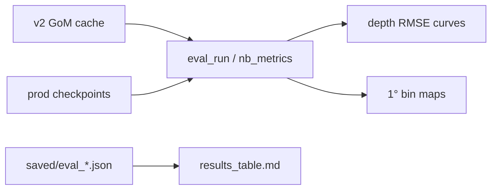

# Phase 6 — GoM diagnostics and results narrative

**Branch:** `nespreso-v2-port`  
**Status:** **NEARLY CLOSED** — GoM diagnostics + results table + decoder eval hygiene done  
**Dropped:** Global / full-planet model training (Phase 4c and v1 global cache path)

---

## Goal

Use existing eval + notebook infrastructure on **GoM production data** to visualize model behavior (depth curves, spatial bin maps) and lock in a **reproducible results narrative** — without new architecture sweeps or global training.

**Not the goal:** Global model, Phase 4c DDP, Phase 5 resume, or cross-tag RMSE headlines without `eval_matched.py`.

---

## Production baseline (unchanged)

| Tag | Config | Checkpoint | Test `raw_profile_rmse` |
|-----|--------|------------|-------------------------|
| ISAS GoM | `config_isas_patch.json` | `patch16_scales/model_best.pth` | T **1.016** / S **5.318** |
| ARGO GoM | `config_argo.json` | `argo16_scales/model_best.pth` | T **0.416** / S **0.072** |

Phase 5 AE/decoder code stays as **science appendix** only ([`PLAN-phase5.md`](PLAN-phase5.md)).

---

## Pipeline



Reuse: [`nb_metrics.py`](NeSPReSO2_onTemplate/notebooks/nb_metrics.py), [`run_compare.py`](NeSPReSO2_onTemplate/notebooks/run_compare.py), [`compare_v2_vs_template.ipynb`](NeSPReSO2_onTemplate/notebooks/compare_v2_vs_template.ipynb).

---

## Task list

| # | Task | Status | Notes |
|---|------|--------|-------|
| 6.1 | GoM ML diagnostics (depth curves, bin maps) | **done** | `scripts/gom_diagnostics.py` |
| 6.2 | Results table from `saved/eval_*.json` + Phase 5 verdict | **done** | `scripts/results_table.py` |
| 6.3 | Decoder eval `loss: NaN` fix (appendix) | **done** | `DecoderProfileLoss` uses `nanmean`; decoder16 test loss ~0.19 |
| 6.4 | Headless compare refresh (`run_compare.py`) | **P2** | Optional — `gom_diagnostics` covers prod ISAS |

**Cancelled (global model dropped):**

| Was | Reason |
|-----|--------|
| `config_isas_global_*.json`, v1 global cache | Out of scope — GoM-only production |
| Phase 4c global train + DDP | Dropped — no global predictions planned |
| `scripts/global_eda.py` | Removed — was v1 global satellite EDA only |

---

## Explicitly out of scope

- Full-planet / v1 global training or transfer eval
- Phase 5 resume (AE decoder, dim32, satres)
- `combo_phase4b_all` on GoM
- New experiment-tracking deps

---

## Success criteria

1. GoM diagnostic pipeline runs end-to-end on HPC (figures + JSON report).
2. Production numbers and Phase 5 verdict in one reproducible artifact (`saved/results/eval_table.md`).
3. `patch16_scales` remains ISAS default — no new production training path.

---

## Quick commands

```bash
cd NeSPReSO2_onTemplate

# GoM diagnostics + results table
srun --ntasks=1 --cpus-per-task=8 --gres=gpu:1 python3 scripts/gom_diagnostics.py
srun --ntasks=1 --cpus-per-task=8 python3 scripts/results_table.py

# Production eval (unchanged)
srun --ntasks=1 --cpus-per-task=8 --gres=gpu:1 \
  python3 eval_run.py -c config_isas_patch.json \
  -r saved/models/NeSPReSO2_ISAS_GoM_patch/patch16_scales/model_best.pth \
  --out saved/eval_isas_patch16_pca_test.json
```

---

## Related

| Doc | Purpose |
|-----|---------|
| [HANDOFF.md](HANDOFF.md) | Live status |
| [PLAN-phase5.md](PLAN-phase5.md) | AE/decoder close-out |
| [PLAN-patch-arch-handoff.md](PLAN-patch-arch-handoff.md) | Phases 1–4b |
