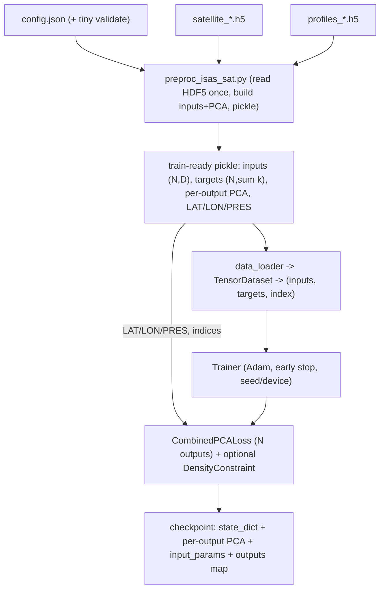

# Port NeSPReSO (v2) into ISAS20_project — ponytail mode

**Plan only** (this document). Implementation follows after approval. Governing style:
**ponytail (lazy senior dev)** — reuse stdlib/template/existing deps first, fewest files,
deletion over addition, no unrequested abstractions, mark shortcuts with `ponytail:`
comments, and leave exactly **one runnable check** behind for non-trivial logic. Still
not lazy about: trust-boundary validation, numerical reproducibility, no `/unity`
hardcoding.

## Source and target

- Source of truth: `v2-nespreso` — `PredictionModel`, `RhoMLP`/`DensityConstraint`,
  `CombinedPCALoss`, PCA helpers, determinism.
- Target (this repo): `NeSPReSO2_onTemplate` — victoresque template with placeholder
  MNIST model/loss, an existing `preproc/preproc_isas_sat.py`, and gridded-satellite
  HDF5 under `data/`.

## Two confirmed plan changes

1. **Configurable inputs** via one `offset` notion (`spatial_pad`, `temporal_pad`).
   `0,0` = center-pixel SST/SSS/SSH + cyclic time/lat/lon = v2's point inputs.
   `>0` = flatten selected satellite patches over (time x space).
2. **Configurable outputs + per-variable encode size** via config. `outputs` is an
   ordered map `{name: n_components}`, e.g. `{temperature: 15, salinity: 15}` (add
   `density`/others later, no code change). `output_dim = sum(n_components)`. Loss/PCA/
   inverse all split by per-variable offsets instead of v2's hardcoded two equal halves.
   ponytail: PCA is the only encoder now (VAE/DIRESA are YAGNI; the map leaves room
   without building them).

## Ponytail deltas (what we are NOT building)

- **No parallel typed-config/dataclass layer.** The template already has `config.json`
  + `parse_config.ConfigParser`. Extend the JSON + one tiny `validate()`.
- **No new caching subsystem.** `preproc/preproc_isas_sat.py` already reads HDF5 once
  and pickles. Extend it to emit the train-ready pickle; reuse it as the cache.
- **No new determinism module.** `train.py` already seeds; reuse it + a `prepare_device`
  helper.
- **Fewest files.** PCA reconstruction helpers go inside `model/loss.py` (its only
  consumer), not a separate `pca.py`.
- **Density penalty defaults OFF** in the first port (pulls an external `rhoMLP_*.pt`
  and adds a sizeable code path). Wired but opt-in; flagged.

## Data flow (target)

## Module mapping (into existing files where possible)

- `src/nespreso/models/mlp.py` `PredictionModel` -> `model/model.py` (replace buggy
  `FFNN`; fix the `forward`-indented-inside-`__init__` bug). Config-driven `input_dim`,
  `layers_config`, `output_dim`, `dropout_prob`.
- `src/nespreso/losses.py` + `src/nespreso/data/pca.py` -> `model/loss.py` (replace
  `nll_loss`). **Generalize** `PCALoss`/`CombinedPCALoss` to iterate an ordered
  `outputs` list with per-variable component counts, PCA models, and per-variable scale
  constants (default to v2's `37.86/0.28` and `2.8294/0.0255` for temp/sal).
- `src/nespreso/models/density.py` -> `model/density.py` (verbatim; frozen surrogate).
  Used only when `density.enabled`.
- `set_seed`/`get_device` -> reuse `train.py` seeding + a `prepare_device` helper (no new
  module).

## Phases (one commit each; repo importable after each)

### Phase 0 - Setup
- Feature branch. Add only **missing** deps to `requirements.txt`: `scikit-learn`,
  `h5py`, `pyyaml` (`numpy`/`torch`/`tqdm` already present). `SOURCES.md` mapping ported
  blocks to v2.

### Phase 1 - Port compute (no behavior change except bug fix + N-output generalization)
- `model/model.py`: PredictionModel, fix forward bug.
- `model/loss.py`: WeightedMSELoss, PCALoss, CombinedPCALoss, torch reconstruction
  helpers; generalize the temp/sal split to the `outputs` map. Keep exact constants as
  defaults.
- `model/density.py`: RhoMLP + DensityConstraint verbatim.

### Phase 2 - Config (extend, don't add a layer)
- Extend `config.json`: `arch.args {input_dim, layers_config:[512,512], dropout_prob:0.2}`;
  `optimizer Adam lr:0.001`; `trainer {epochs, patience}`; `input_params {timecos..ssh, sat}`;
  `io {spatial_pad:0, temporal_pad:0, groups}`; `outputs {temperature:15, salinity:15}`;
  `density {enabled:false, ...}`; `seed`.
- Add `validate(config)` (~5 lines): `output_dim == sum(outputs.values())`, pads `>= 0`,
  density paths exist when enabled. Fail fast (trust boundary).

### Phase 3 - I/O via existing preproc (the main efficiency work)
- Extend `preproc/preproc_isas_sat.py` to, in **one** vectorized pass: select configured
  groups/vars and `station_indices`; build the `float32` input matrix (offset=0 -> center
  pixel only, avoid loading full patches; offset>0 -> patches flattened in documented
  row-major order); fit one `sklearn` PCA per `outputs` entry with its own `n_components`;
  concatenate to the target matrix; keep `LAT/LON/PRES`; pickle it all (this pickle **is**
  the cache, keyed by a config hash in the filename).
- `data_loader/data_loaders.py`: thin loader that reads the pickle into tensors and yields
  `(inputs, targets, index)` (index needed for density lookups). Optional
  `pin_memory`/`num_workers`; ponytail: if tensors are small, move once to GPU.

### Phase 4 - Trainer
- Adapt `trainer/trainer.py` to 3-tuple batches + `criterion(out, tgt, idx)`; drop MNIST
  `make_grid`. Build `CombinedPCALoss` in `train.py` after dataset exists (needs
  PCA+weights+device) — documented deviation from `getattr(loss)`. Adam(lr); reuse template
  early-stop, seed, `prepare_device`. Checkpoint: `state_dict`, per-output PCA,
  `input_params`, `outputs`.

### Phase 5 - Inference + metric
- `model/metric.py`: generalized `inverse_transform` (split by `outputs`) + per-variable
  profile RMSE. Wire `test.py`.

### Phase 6 - One runnable check (ponytail)
- `selfcheck.py` using bare `assert` (no pytest, no fixtures): (a) offset=0 path reproduces
  v2 `PredictionModel`+loss on shared inputs within `1e-6`; (b) PCA round-trip; (c) N-output
  split offsets are correct for an asymmetric config (e.g. `{temperature:15, salinity:12}`).
  Run via `srun --ntasks=1 --cpus-per-task=8`.

### Phase 7 - Docs
- Short README note (offset semantics, configurable outputs/components, cache,
  v2-equivalence). Finalize `SOURCES.md`.

## Needs human review / flags

- Loss scale constants (`37.86/0.28`, `2.8294/0.0255`) are GoM/temp-sal-specific;
  defaulted per-variable, must be re-derived for new outputs or non-GoM data. `ponytail:`
  comment names this ceiling.
- PCA fit-vs-load: default fit (v2 behavior); shipped `base/pca_*.pkl` won't match a fresh
  fit.
- Density surrogate paths injected via config only (no `/unity` hardcoding); penalty off by
  default.
- `offset>0` patch flattening order is fixed by us; documented so it stays stable across
  cache rebuilds.
