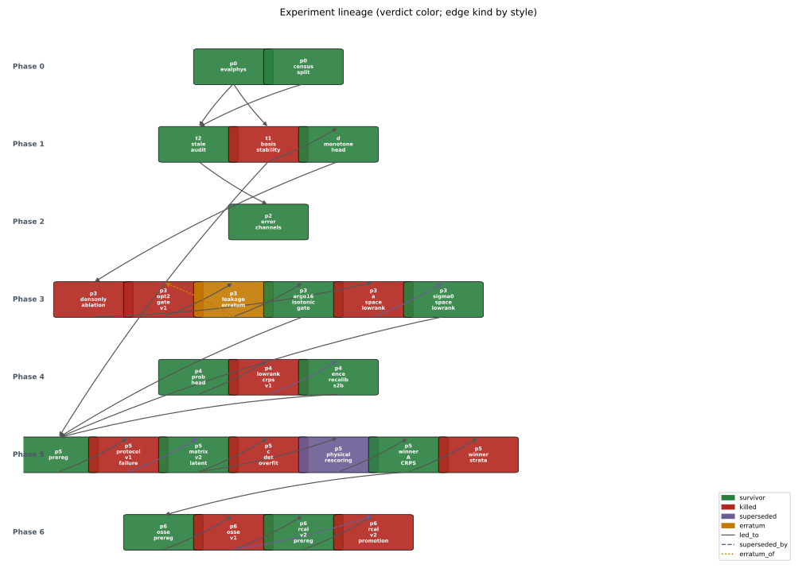
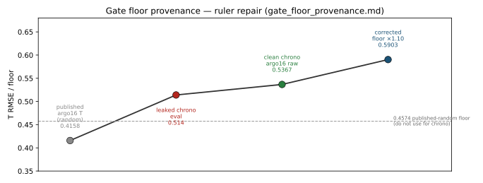
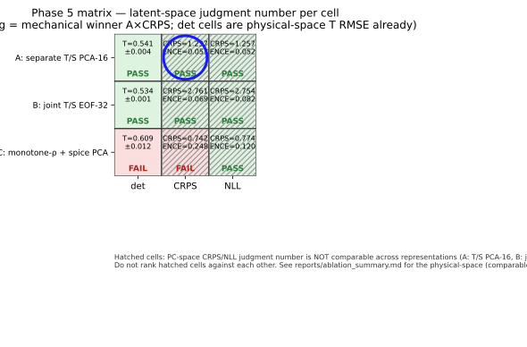
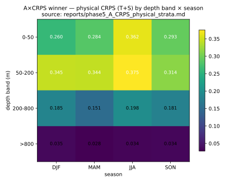
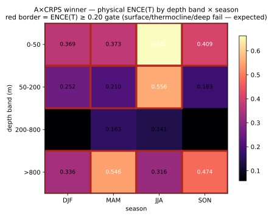

# Project evolution — provenance-traced report

**Artifacts frozen — no re-scoring.**  
`git_sha_head=73fa5f6236f54aa206e16c1df7750604df71f63e` · `evalphys=1.1.0` (`git_sha=7f9a043953361931db671903c5bbee2744b7b8fe`, frozen 2026-07-16) · `generated=2026-07-20T10:05:37-04:00`

> **Warning:** `METRICS_MANIFEST.json` git_sha (`7f9a043…`) ≠ HEAD (`73fa5f6…`). Metric definitions are unchanged; the manifest sha is stale relative to HEAD. ([PROVENANCE.json](PROVENANCE.json) contradiction `c1_manifest_sha_stale`)
>
> **Warning:** `saved/runs/phase6_osse/run.log` records E4=2.4186 / E5=1.8906, which disagrees with committed `cast_column_s42.json` and [osse_results.md](../osse_results.md) (E4=0.6160 / E5=1.4008). Displayed OSSE numbers use only the agreeing JSON+MD pair. ([PROVENANCE.json](PROVENANCE.json) contradiction `c2_osse_runlog_vs_committed_results`)

---

## 1. Abstract

This report reconstructs the NeSPReSO dissertation experiment lineage from frozen reports only — no model was run, retrained, or re-scored. The chronological skill ruler was repaired after a leakage erratum (published random-split argo16 T 0.4158 → leaked chrono 0.514 → clean chrono 0.5367 → corrected floor 0.5903; [gate_floor_provenance.md](../gate_floor_provenance.md)). Under the Phase 5 physical-space Section 3 rule, **B×det** holds the lowest deterministic T RMSE (0.534) and **A×CRPS** is the probabilistic default (phys CRPS 0.119, phys ENCE 0.153); **C** (density/spice) clears neither the det floor nor physical ENCE ([ablation_summary.md](../ablation_summary.md)). The same A×CRPS winner fails physical ENCE(T) in strata (overall 0.2362), worst in the thermocline ([phase5_A_CRPS_physical_strata.md](../phase5_A_CRPS_physical_strata.md)). The Phase 6 cast-column OSSE does not clear its preregistered claims: NeSPReSO ties ISOP (E3=0.5454 vs E2=0.5410) and full-localized R_cal is worse than fixed R (E4=0.6160); both `E3_gt_E2` and `E4_ge_E3` are **FAIL** ([osse_results.md](../osse_results.md)).

---

## 2. Timeline

| phase | question | change | verdict | source |
|-------|----------|--------|---------|--------|
| 0 | What data exist; which split is viable? | Census n=4145 (2015–2022); default B chrono 70/15/15 (2901/621/623); freeze evalphys 1.1.0 | survivor | [data_census.md](../data_census.md), [split_design.md](../split_design.md), [METRICS_MANIFEST.json](../../NeSPReSO2_onTemplate/evalphys/METRICS_MANIFEST.json) |
| 1 | Do soft bases fix stability? Is sat input stale? | T1 soft B/C fail ≥5× N² cut; D monotone 21.51%→0.48%; T2 stale 0.0% gate OPEN | T1 soft killed; D+T2 survivor | [phase1_decisive_tests.md](../phase1_decisive_tests.md), [stale_by_split.md](../stale_by_split.md) |
| 2 | Which error field names exist on disk? | Record `err_sla` / `analysis_error` / `sos_error`; full `inputs_err` gated on v3 | survivor (scaffolding) | [phase2_2_error_channels.md](../phase2_2_error_channels.md) |
| 3 | Can monotone density + low-rank clear the skill floor? | Leakage erratum repairs ruler to 0.5903; a-space low-rank killed (T 0.8297); σ₀-space low-rank admits (T 0.5621) | erratum + mixed | [gate_floor_provenance.md](../gate_floor_provenance.md), [phase3_lowrank_sigma0_spice_eval.md](../phase3_lowrank_sigma0_spice_eval.md) |
| 4 | Is the heteroscedastic head calibrated? | lowrank_crps_v1 ENCE 0.3611 MISS; s2b+per_dim ENCE 0.1603 PASS | v1 killed; s2b survivor | [phase4_lowrank_crps_eval.md](../phase4_lowrank_crps_eval.md), [phase4_ence_recalib_s2b.md](../phase4_ence_recalib_s2b.md) |
| 5 | Which of 3×3 cells survive a fair protocol? | Protocol v2 matrix; physical §3 pick A×CRPS; B×det best det; C loses both; strata ENCE(T) FAIL | mixed (winner + killed strata) | [ablation_summary.md](../ablation_summary.md), [phase5_A_CRPS_physical_strata.md](../phase5_A_CRPS_physical_strata.md) |
| 6 | Does A×CRPS beat ISOP inside OI? Does R_cal help? | cast-column OSSE E3≈E2; E4 worse; claims FAIL | killed | [osse_results.md](../osse_results.md), [HANDOFF.md](../../HANDOFF.md) |

---

## 3. Lineage narrative

Nodes and edges: [lineage.json](lineage.json). Dead branches and the ruler repair are first-class events, not footnotes.

1. **Phase 0–1 foundation.** evalphys freeze and the chronological census/split precede every gate ([METRICS_MANIFEST.json](../../NeSPReSO2_onTemplate/evalphys/METRICS_MANIFEST.json), [data_census.md](../data_census.md), [split_design.md](../split_design.md)). T2 finds 0.0% stale and leaves the headline gate OPEN ([stale_by_split.md](../stale_by_split.md); JSON `headline_metrics_embargoed=false` — agrees with MD OPEN; contradiction check `c3_stale_gate_md_json` is a non-issue).
2. **T1 soft bases killed.** Pre-registered ≥5× N² cut is **NOT MET**; historical σ₀ profile rates A=21.51%, B=22.63%, C=21.83% vs D=0.48% ([phase1_decisive_tests.md](../phase1_decisive_tests.md)). Soft representation change does not buy stability; R1 accepts the hard monotone path.
3. **Ruler repair (erratum).** Published argo16 T 0.4158 is a random-split number; chrono eval 0.514 of that checkpoint is leaked-optimistic; clean chrono raw is 0.5367; operative floor is 0.5903 ([gate_floor_provenance.md](../gate_floor_provenance.md)). The earlier opt-2 gate vs 0.4574 is **killed** on the published ruler ([phase3_argo16_isotonic_gate.md](../phase3_argo16_isotonic_gate.md)); the clean re-run **passes** the corrected floor at T=0.5367 with pre-inv σ₀=0 ([phase3_argo16_isotonic_gate_clean.md](../phase3_argo16_isotonic_gate_clean.md)).

4. **a-space killed; σ₀-space admits.** a-space recon RMSE 0.925 (> clim 0.722), overall T 0.8297 — gate FAIL ([phase3_lowrank_delta_a_eval.md](../phase3_lowrank_delta_a_eval.md)). σ₀-space low-rank T 0.5621 ≤ 0.5903 — admission PASS, not the dissertation headline ([phase3_lowrank_sigma0_spice_eval.md](../phase3_lowrank_sigma0_spice_eval.md), [gate_floor_provenance.md](../gate_floor_provenance.md)).
5. **Phase 4 calibration path.** Two-stage CRPS v1 test ENCE 0.3611 MISS ([phase4_lowrank_crps_eval.md](../phase4_lowrank_crps_eval.md)); s2b + per_dim ENCE 0.1603 PASS ([phase4_ence_recalib_s2b.md](../phase4_ence_recalib_s2b.md)).
6. **Phase 5 matrix.** Protocol v1 C×CRPS ENCE 0.225 MISS; protocol v2 rescored. Latent survivors and physical §3 pick below. C×det admission 0.562 does not replicate (0.609±0.012) ([finding_C_det_gate_overfit.md](../finding_C_det_gate_overfit.md)).
7. **Strata kill the uniform-calibration claim.** Overall ENCE(T)=0.2362 ([phase5_A_CRPS_physical_strata.md](../phase5_A_CRPS_physical_strata.md)).
8. **OSSE claims FAIL.** E3=0.5454 vs E2=0.5410; E4=0.6160; both gates FAIL ([osse_results.md](../osse_results.md)). Full-localized R_cal is OI-stable but worse than diag-control 0.546 ([HANDOFF.md](../../HANDOFF.md)).

---

## 4. Matrix result

**Stated plainly** ([ablation_summary.md](../ablation_summary.md), latent cell reports `reports/phase5_*.md`, floor [gate_floor_provenance.md](../gate_floor_provenance.md)):

| claim | number | source |
|-------|-------:|--------|
| B won deterministic RMSE | **0.534** (≤ floor 0.5903) | [phase5_B_det.md](../phase5_B_det.md) |
| A won the probabilistic crown (A×CRPS) | phys CRPS **0.119**, phys ENCE **0.153**, T **0.559** | [ablation_summary.md](../ablation_summary.md) |
| C lost both | det T **0.609** (>0.5903); phys ENCE C×CRPS **0.384**, C×NLL **0.397** | [phase5_C_det.md](../phase5_C_det.md), [ablation_summary.md](../ablation_summary.md) |

Latent PC-space CRPS must not be ranked across A/B/C (hatched on the figure). Latent ENCE clears for A×CRPS at 0.053 ([phase5_A_CRPS.md](../phase5_A_CRPS.md)) — that is PC-space calibration, not the physical strata result below.

---

## 5. Calibration reality

A×CRPS **clears ENCE in PC space** (latent mean ENCE 0.053 < 0.20; [phase5_A_CRPS.md](../phase5_A_CRPS.md)) and **clears pooled physical ENCE(T+S)** in the matrix table (0.153; [ablation_summary.md](../ablation_summary.md)), but **fails in physical T space at overall ENCE(T)=0.2362** ([phase5_A_CRPS_physical_strata.md](../phase5_A_CRPS_physical_strata.md)). Worst bands: 0–50 m (ENCE up to 0.6622 in JJA), 50–200 m (thermocline; 0.5560 in JJA), and >800 m (0.5456 in MAM). Cells with ENCE ≥ 0.20 carry a fail border on the ENCE figure — that lighting is correct, leave it.

---

## 6. OSSE result

**Without spin** ([osse_results.md](../osse_results.md), [HANDOFF.md](../../HANDOFF.md)):

| claim | numbers | verdict |
|-------|---------|---------|
| NeSPReSO vs ISOP (E3 vs E2) | 0.5454 vs 0.5410 | **FAIL** (`E3_gt_E2`) — ties, does not beat |
| R_cal vs fixed NeSPReSO R (E4 vs E3) | 0.6160 vs 0.5454 | **FAIL** (`E4_ge_E3`) |
| calibrated R vs diagonal control | E4 full 0.616 vs diag-control 0.546 | full-localized worse; diagonal preferred ([HANDOFF.md](../../HANDOFF.md)) |

Labeled caveats on the figure and here: cast-column proxy (no 2021 ISAS grid); E0≡E1; v1 was diagonal-R-only (superseded); v2 promotion is full Schur-localized Σ_T with diag-control 0.546 ([HANDOFF.md](../../HANDOFF.md)). E5 retention 0.444, RMSE 1.4008 ([osse_results.md](../osse_results.md)).

---

## 7. What is genuinely established vs. what is not

| established | not established |
|-------------|-----------------|
| Chronological split B is the dissertation default (2901/621/623) — [split_design.md](../split_design.md) | Map-level OSSE with ISAS truth + L_h ([HANDOFF.md](../../HANDOFF.md) next-steps) |
| T2 stale gate OPEN at 0.0% — [stale_by_split.md](../stale_by_split.md) | Product error channels as model inputs (v3 gated) — [phase2_2_error_channels.md](../phase2_2_error_channels.md) |
| Soft bases do not deliver ≥5× stability cut; hard monotone does (21.51%→0.48%) — [phase1_decisive_tests.md](../phase1_decisive_tests.md) | Uniform physical calibration of A×CRPS across depth×season — **FAIL** ENCE(T)=0.2362 |
| Corrected same-split floor is 0.5903 — [gate_floor_provenance.md](../gate_floor_provenance.md) | C as a skill-floor or phys-ENCE survivor under 3-seed protocol |
| §3 mechanical default is A×CRPS; best det is B×det 0.534 — [ablation_summary.md](../ablation_summary.md) | E3>E2 or E4≥E3 in cast-column OSSE — both **FAIL** |
| Compress in physical σ₀ space, constrain after — [finding_compress_physical_space.md](../finding_compress_physical_space.md) | Cross-level CRPS-head correlations as useful R structure — E4 full 0.616 > diag 0.546 |

---

## Appendix — reused diagnostic PNGs (not regenerated)

Provenanced references only; files live under `NeSPReSO2_onTemplate/notebooks/compare_outputs/`.

- [depth_rmse_bias.png](../../NeSPReSO2_onTemplate/notebooks/compare_outputs/depth_rmse_bias.png) — `fig_reuse_depth_rmse_bias`
- [argo_production_depth_rmse.png](../../NeSPReSO2_onTemplate/notebooks/compare_outputs/argo_production_depth_rmse.png) — `fig_reuse_argo_production_depth_rmse`
- [depth_rmse_overlay.png](../../NeSPReSO2_onTemplate/notebooks/compare_outputs/depth_rmse_overlay.png) — `fig_reuse_depth_rmse_overlay`

Every figure and table above is registered in [PROVENANCE.json](PROVENANCE.json). No number appears here that is absent from that manifest's sourced artifacts.
