# July briefing — Phase 5 matrix & Phase 6 OSSE

## 0. Where we were *before* this update

Roughly mid-July, after Phases 0–4 and **before** the fair 3×3 bake-off and the data-assimilation toy experiment:

**The scientific question.** Can a neural net, fed only satellite surface fields at an ARGO float location, reconstruct the subsurface temperature and salinity profile — and can its uncertainty be trusted enough to use those profiles as “pseudo-observations” in a simple analysis (optimal interpolation)?

**What already worked.**


| piece                             | plain-language meaning                                                                                                                                                          |
| --------------------------------- | ------------------------------------------------------------------------------------------------------------------------------------------------------------------------------- |
| Gulf of Mexico ARGO cache         | ~4100 profiles, 2015–2022; chronological train/val/test (~70/15/15)                                                                                                           |
| Shared backbone                   | `PatchConvMLP` (convolutional patch encoder + MLP), width 128 — **same** network family for everything below                                                                    |
| Surface inputs                    | L4 SST, SSH/ADT, SSS (+ time/location). Served via a **regional datacube + on-demand sampler** (see §1.5), not only ad-hoc per-cast HDF5 patches |
| Skill floor                       | Same-split chrono “argo16” baseline T RMSE **0.5367**; we treat **0.5903** (= ×1.10) as “close enough” for a new method to be interesting                                       |
| Density path (later called **C**) | Predict density anomaly + “spice,” invert to T/S; enforce density increasing with depth at inference. Single-run T ≈ **0.562** (clears 0.5903)                                  |
| Probabilistic head                | Network can output a mean and a spread (σ). First long CRPS run was under-calibrated (ENCE ~0.36); a longer second stage + validation-only σ rescaling recovered ENCE ~**0.16** |


**What we had *not* done yet.**

- A fair comparison of three profile representations (A/B/C) × three training objectives (det / CRPS / NLL) under identical data, seeds, and stopping rules.
- A locked “does this help data assimilation?” test against an operational-style synthetic-profile baseline (ISOP/MODAS-class).
- Depth×season diagnostics of whether the uncertainty is trustworthy where the ocean actually varies (surface and thermocline).

**Orientation.** Phases 0–4 built the ruler and showed one promising density recipe. July’s Phase 5–6 ask: *which recipe survives a bake-off, and does the winner help an analysis?*

---


## 1. What the system does (one picture)

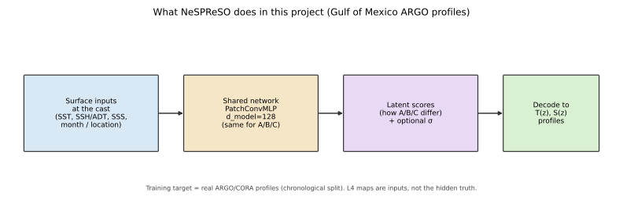

1. At each float location and time, read surface fields.
2. Run them through the shared `PatchConvMLP`.
3. Predict a small set of **latent scores** (this is where A/B/C differ).
4. Decode scores back to full-depth **T(z)** and **S(z)**.
5. (Probabilistic heads only) also predict a spread and, for assimilation, turn that into an observation-error covariance.

Training truth is always the ARGO profile — not a gridded ocean product pretending to be truth.

---

## 1.5 The datacube — where surface inputs come from

Before the July bake-off, the branch also replaced a brittle **per-cast HDF5 patch** pipeline with a **single regional store** that every model flavor can sample from.

| | legacy | cube path |
|--|--------|-----------|
| Store | Per-station HDF5 windows (fixed spatial/temporal pads) | One daily Zarr over the GoM box (`gom_cube.zarr`) |
| How a cast gets fields | Pre-cut patch around the float | On-demand bilinear sample at (lat, lon, time) |
| Why bother | Easy to freeze stale satellite values into patches; awkward to add product-error channels | One geometry for point / patch / residual readers; cleaner stale audits; room for v3 error channels |

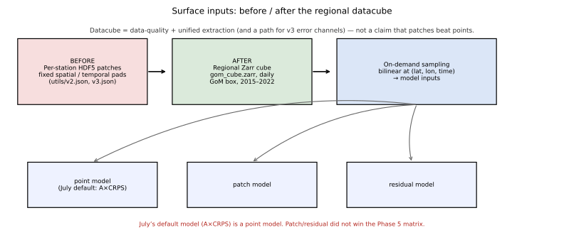

**For this briefing:** treat the cube as **infrastructure** — a data-quality and extraction fix. July’s default model (**A×CRPS**) is still a **point** model. The cube does **not** mean “patch models won”; the patch/residual path did not win the Phase 5 matrix.

---

## 2. Flavors A, B, and C — what actually differs

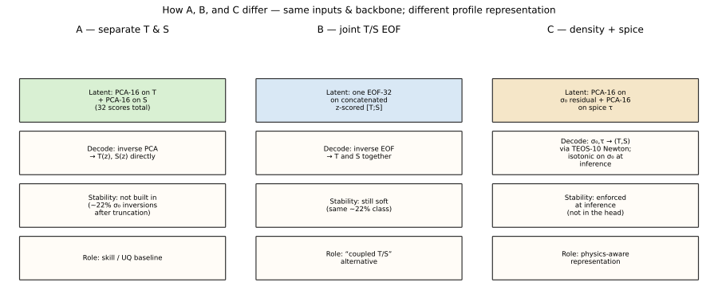

Everything below shares: chronological split, same cache family, same backbone width, Adam, three seeds `{42,43,44}` in the matrix.

A/B/C change **which linear target** is compressed (separate PCA, joint EOF, or density/spice PCA) — they are **not** learned encoder–decoders. A nonlinear profile autoencoder path was tried earlier and set aside (§8).

|                                               | **A — separate T/S PCA**                                                                  | **B — joint T/S EOF**                             | **C — density + spice**                                                                                 |
| --------------------------------------------- | ----------------------------------------------------------------------------------------- | ------------------------------------------------- | ------------------------------------------------------------------------------------------------------- |
| **Idea**                                      | Compress temperature and salinity separately                                              | Compress T and S as one coupled field             | Compress physical density (σ₀) and spice (τ), then invert to T/S                                        |
| **Latent space**                              | PCA-16 on T + PCA-16 on S (32 scores)                                                     | One joint EOF with 32 modes on concatenated [T;S] | PCA-16 on σ₀−clim + PCA-16 on spice                                                                     |
| **Decode**                                    | Inverse PCA → T,S                                                                         | Inverse EOF → T,S                                 | σ₀,τ → (T,S) with TEOS-10 Newton inversion                                                              |
| **Stability (density increasing with depth)** | Not enforced (~22% of truncated profiles invert)                                          | Same story as A                                   | Enforced **at inference** by isotonic projection on σ₀ (not hard-wired inside the network for matrix C) |
| **Why we kept it in the bake-off**            | Strong historical baseline (“argo16” lineage)                                             | Tests whether coupling T/S in one basis helps     | Tests whether a physics-motivated latent space wins on skill *and* calibration                          |
| **Hyperparameters that matter**               | PCA rank 16+16; det early-stop on val loss; prob: two-stage μ→σ, stage-2 stop on val ENCE | EOF rank 32; same head schedules as A             | Rank 16+16; mandatory isotonic on the decode path; same head schedules                                  |


**Inputs are the same.** **Outputs are always T/S profiles** (C just takes a detour through density/spice). **Architecture width is the same.** The scientific bet is almost entirely in the *target representation* and the *loss*.

---


## 3. The three heads — what the network is asked to learn

A **deterministic** head outputs only a best-guess profile. A **probabilistic** head also outputs a spread (how unsure it is). Before the head table, three scores that show up everywhere below:

### CRPS, NLL, and ENCE (read this once)

Imagine the network says: “temperature here is about 20 °C, give or take 1 °C.”


| acronym  | full name                             | what question it answers                                                                 | intuition                                                                                                                                                                                | better when                                                                |
| -------- | ------------------------------------- | ---------------------------------------------------------------------------------------- | ---------------------------------------------------------------------------------------------------------------------------------------------------------------------------------------- | -------------------------------------------------------------------------- |
| **CRPS** | Continuous Ranked Probability Score   | How good is the *whole* forecast distribution (mean + spread) against the truth?         | Like RMSE, but you also get credit/penalty for whether your stated uncertainty was useful — not only whether the center was close                                                        | **Lower**                                                                  |
| **NLL**  | (Gaussian) Negative Log-Likelihood    | Under a normal-distribution assumption, how surprising was the truth given your μ and σ? | Punishes being confidently wrong harder than CRPS often does; rewards a well-matched σ                                                                                                   | **Lower**                                                                  |
| **ENCE** | Expected Normalized Calibration Error | Are your stated uncertainties the *right size* on average?                               | If you say ±1 °C and typical errors are really ~2 °C, you are **under-dispersed** (overconfident) and ENCE rises. If spreads are huge while errors are small, you are **over-dispersed** | **Lower** (we treat **< 0.20** as “acceptably calibrated” in this project) |


**How they differ in practice**

- **CRPS and NLL** are *training losses and skill scores* for probabilistic heads. They care about both accuracy and spread.  
- **ENCE** is a *calibration diagnostic*. A model can have decent CRPS and still fail ENCE (sharp but wrongly sized σ), or clear ENCE while CRPS is mediocre (honest but dull spreads).  
- **det** heads have no σ, so CRPS/NLL/ENCE do not apply; we only quote temperature **RMSE** (°C).

**One more term:** **Spearman** correlation between predicted spread and absolute error — “when the model says it is unsure, is it actually more wrong?” Useful for ranking which casts to trust; not a calibration size check like ENCE.

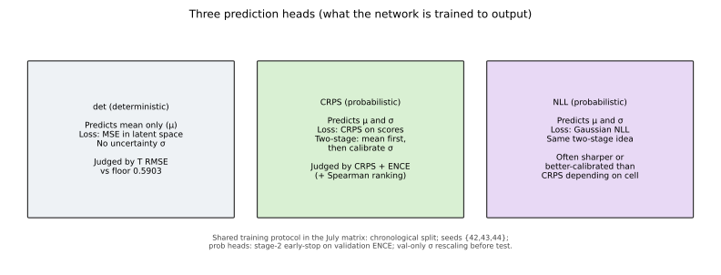


| head     | outputs                   | trained with                                     | what “good” means here                                           |
| -------- | ------------------------- | ------------------------------------------------ | ---------------------------------------------------------------- |
| **det**  | mean profile only         | MSE in latent space                              | Low temperature RMSE (≤ 0.5903 is “in the game”)                 |
| **CRPS** | mean + per-score spread σ | Minimize CRPS (two-stage: fit mean, then spread) | Low CRPS **and** ENCE < 0.20 (plus Spearman if we claim ranking) |
| **NLL**  | mean + σ                  | Minimize Gaussian NLL (same two-stage idea)      | Same idea as CRPS head, different scoring rule while training    |


---


## 4. What July actually ran


### Phase 5 — the 3×3 matrix

Nine cells × three seeds, locked in advance ([`ablation_preregistration.md`](../ablation_preregistration.md)):

```
{A, B, C}  ×  {det, CRPS, NLL}
```

Protocol that mattered: for probabilistic cells, stop the second training stage when **validation ENCE** stops improving (not when loss stops). An earlier “stop on loss” protocol under-trained the spread and looked fine until we checked calibration.

After scoring in latent space, we **re-decoded to physical T/S** and ranked cells there — because CRPS numbers in different latent bases are not comparable (A’s “1.24” is not the same currency as C’s “0.74”).

### Phase 6 — the OSSE ladder

See **§7** for the full explanation. One-liner: at real 2021 ARGO positions, blend climatology with synthetic “casts” (ISOP vs NeSPReSO) using optimal interpolation, and ask whether ML beats a classical synthesizer and whether learned uncertainty helps ([`osse_preregistration.md`](../osse_preregistration.md), [`osse_results.md`](../osse_results.md)). E3–E5 use **A×CRPS**.

---


## 5. Matrix result (who won what)

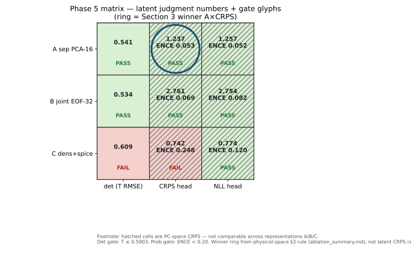

Physical-space summary ([`ablation_summary.md`](../ablation_summary.md)):


| cell           | T RMSE      | physical CRPS | physical ENCE | reading                                                                 |
| -------------- | ----------- | ------------- | ------------- | ----------------------------------------------------------------------- |
| **B×det**      | **0.534**   | —             | —             | Best point forecast in the matrix                                       |
| A×det          | 0.541       | —             | —             | Matches the clean argo16 ballpark                                       |
| **A×CRPS**     | 0.559       | **0.119**     | **0.153**     | **Default probabilistic model** (best CRPS among well-calibrated cells) |
| A×NLL          | 0.575       | 0.122         | 0.162         | Close second on CRPS                                                    |
| B×CRPS / B×NLL | 0.59 / 0.56 | 0.13 / 0.13   | 0.25 / 0.30   | Uncertainty not trustworthy enough on the physical ruler                |
| C×det          | 0.609       | —             | —             | Misses the 0.5903 skill line under the fair 3-seed protocol             |
| C×CRPS / C×NLL | 0.62 / 0.69 | 0.14 / 0.16   | 0.38 / 0.40   | Physics latent space did **not** win calibration                        |


**In one sentence:** B is the best thermometer; A×CRPS is the model we take forward when we also need uncertainty; C fixed a real stability problem earlier but did not win this bake-off.

---


## 6. Is the uncertainty good where it matters?

Recall from §3: **ENCE** asks whether predicted spreads are the right *size*; **CRPS** asks how good the full distribution is. Both can be computed either in **latent / PC space** (the coordinates the network trains in) or in **physical temperature** after decoding. Those are not the same exam.

For the default model **A×CRPS** ([`phase5_A_CRPS.md`](../phase5_A_CRPS.md), [`phase5_A_CRPS_physical_strata.md`](../phase5_A_CRPS_physical_strata.md)):


| where we score                                    | what we measure          | number      | reading                                                       |
| ------------------------------------------------- | ------------------------ | ----------- | ------------------------------------------------------------- |
| Latent (PC) space                                 | ENCE on score-space σ    | ≈ **0.053** | Spreads look well sized in the space the loss sees (< 0.20)   |
| Physical T+S (matrix table)                       | pooled ENCE after decode | ≈ **0.153** | Still under 0.20 on the combined T+S diagnostic               |
| Physical **temperature only**, all depths×seasons | ENCE(T)                  | ≈ **0.236** | **Above** 0.20 — temperature uncertainty is mis-sized overall |


Broken out by depth and season (figures below):

- **CRPS** (distribution skill) is largest in the upper ocean / thermocline — errors and/or spreads are hardest there.  
- **ENCE(T)** (calibration) is worst in **0–50 m** and **50–200 m**, especially **JJA** (summer), and also poor below **800 m**. The **200–800 m** band is the well-behaved strip (ENCE mostly < 0.20).  
- Red borders on the ENCE figure mark cells with ENCE ≥ 0.20.

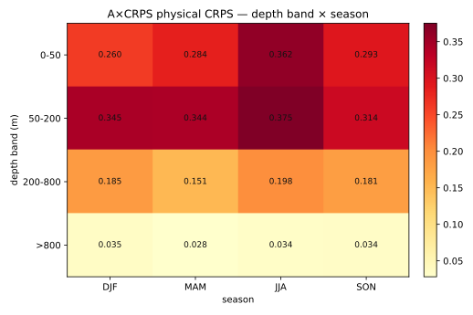

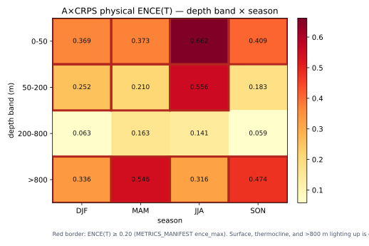

**Why this matters for §7:** the OSSE’s E4/E5 steps *trust* the network’s predicted uncertainty when building observation error **R** and when discarding “uncertain” casts. If ENCE(T) is poor in the surface and thermocline, those spreads are the wrong size precisely where T errors are largest — so a disappointing E4/E5 is not a surprise from a calibration point of view.

---


## 7. OSSE — E0 through E5


### 7.0 What an OSSE is doing here

**OSSE** = Observing System Simulation Experiment. In the textbook version you invent a fake “truth” ocean, draw observations from it, run an analysis, and see if you recover the truth. **Our July run is a stripped-down cousin of that idea**, aimed at one dissertation question:

> If we treat ML (or classical) synthetic profiles as if they were ARGO-like observations, and blend them into a simple climatology with optimal interpolation (OI), does the analysis get closer to the real ARGO profiles — and does NeSPReSO beat a classical synthetic-profile method?

Concrete setup for this project ([`osse_preregistration.md`](../osse_preregistration.md)):

1. Pick real **2021** ARGO locations in the Gulf (**n = 1101** casts).
2. Start from a **background** **x_b**: train-era **monthly climatology** (the same boring prior for every experiment).
3. At each location, invent a synthetic profile **y** (“cast”) from one of several sources (clim / ISOP / NeSPReSO).
4. Blend **x_b** and **y** with **column OI** (depth only — no horizontal spreading of information in this v1).
5. Score the analysis against the **real ARGO** profile at that column (temperature RMSE). Lower is better.

So we are not claiming a full operational forecast system. We are asking whether NeSPReSO pseudo-obs help *this* analysis relative to a classical alternative, under locked rules.

**Why “cast-column proxy”?** The planned map-level OSSE wanted gridded ISAS20 truth and horizontal error scales. 2021 ISAS months were not on disk, so v1 scores only at ARGO columns. Same science question, smaller geometry.

**Link to §3 / §6:** E3 uses the **A×CRPS mean** (the point profile). E4–E5 also use the **CRPS head’s predicted spreads** to build **R** or to reject casts. That is exactly where ENCE/CRPS calibration starts to matter for assimilation, not only for “UQ plots.”

### 7.1 Ladder in plain language

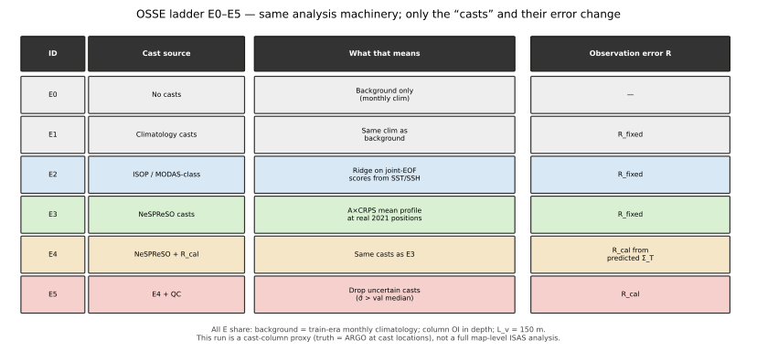

Think of E0→E5 as turning knobs one at a time. The OI machinery stays fixed; only the cast source and its assumed error change.


| ID     | cast source **y**                      | observation-error **R**                           | what question this rung asks                                                                                 |
| ------ | -------------------------------------- | ------------------------------------------------- | ------------------------------------------------------------------------------------------------------------ |
| **E0** | none                                   | —                                                 | How bad is climatology alone?                                                                                |
| **E1** | monthly climatology at the cast        | fixed diagonal from that source’s depth RMSE      | Sanity check: observing the clim with clim-sized errors (here E0≡E1)                                         |
| **E2** | **ISOP/MODAS-class** synthetic profile | fixed diagonal                                    | Classical baseline: ridge regression maps SST/SSH (+ month) → joint-EOF scores → T/S (Fox/Carnes-style idea) |
| **E3** | **NeSPReSO** mean profile (A×CRPS)     | fixed diagonal from NeSPReSO’s depth RMSE         | Holding **R** “fair” (RMSE-based, not learned): does ML beat ISOP?                                           |
| **E4** | same NeSPReSO casts as E3              | **R_cal** from the network’s predicted covariance | Same casts; does *learned* uncertainty improve the blend?                                                    |
| **E5** | subset of E4 casts                     | same **R_cal**                                    | If we drop casts the model flags as uncertain (large mean σ), does the analysis get better?                  |


**ISOP/MODAS-class (E2), one level down:** fit a ridge regressor on the training era that predicts joint T/S EOF coefficients from surface anomalies and seasonal harmonics; decode to a full profile. Observation error is “how wrong was this method on average at each depth,” put on the diagonal of **R**. It is intentionally a strong, boring baseline — not a straw man.

**Shared OI settings:** background = train-era monthly clim; background-error correlation length **L_v = 150 m** in depth only; univariate T and S updates; seed 42 only affects cast iteration order.

### 7.2 The update equations (minimal math)

At each cast column, temperature (same pattern for salinity):

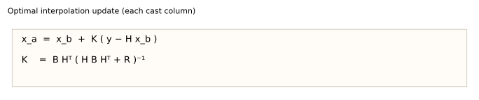

```eq
x_a = x_b + K (y − H x_b)
K   = B Hᵀ (H B Hᵀ + R)⁻¹
```


| symbol  | meaning in this OSSE                                                                |
| ------- | ----------------------------------------------------------------------------------- |
| **x_b** | background profile (climatology)                                                    |
| **y**   | synthetic cast (E1/E2/E3…)                                                          |
| **x_a** | analysis (what we score vs ARGO)                                                    |
| **B**   | background-error covariance in depth (Gaussian correlation, L_v = 150 m)            |
| **R**   | observation-error covariance for that cast source — **main knob between E3 and E4** |
| **H**   | maps state to observation space (here: shared depth grid ≈ identity)                |
| **K**   | Kalman gain: trusts **y** more where **R** is small and **B** is large              |


**Intuition:** if **R** says “this cast is very uncertain at depth z,” the analysis hugs the climatology there. If **R** is too small (overconfident), OI overfits a bad cast. That is why §6’s ENCE story feeds E4.

**Fixed R (E1–E3):**

```eq
R = diag( RMSE(z)² )
```

One number per depth from that cast method’s historical error. No off-diagonal “error correlation between depths.”

**Calibrated R (E4 headline form):** take the CRPS head’s per-score spreads σ, map them through the PCA basis **V**:

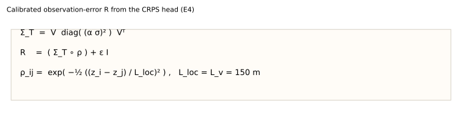

```eq
Σ_T = V  diag( (α σ)² )  Vᵀ

R   = (Σ_T ∘ ρ) + ε I

ρ_ij = exp( −½ ((z_i − z_j) / L_loc)² ) ,   L_loc = L_v
```

Here **α** is the validation-only rescaling of σ from Phase 4/5; **∘** is element-wise (Hadamard) product; **ε I** is a tiny ridge for numerics. Localization preserves `diag(Σ_T)`. A `--rcal diag` switch keeps only that diagonal (the v1 fallback). Raw full **Σ_T** without localization was OI-unstable (condition number ~ 2×10⁸).

**E5 QC rule (locked on validation, not tuned on test):** compute mean predicted spread σ̄ over depth for each cast; set threshold τ = median of σ̄ on **val**; at test keep casts with σ̄ ≤ τ. Retention in the run: **0.444**.

### 7.3 What happened

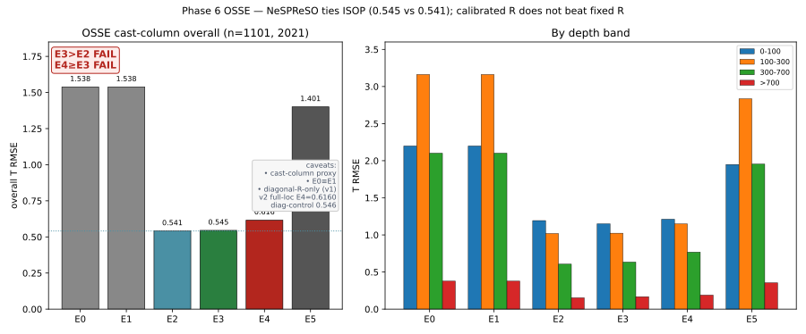


| E                   | overall T RMSE | note                                                                                   |
| ------------------- | -------------- | -------------------------------------------------------------------------------------- |
| E0 / E1             | 1.538          | climatology world; E0≡E1                                                               |
| **E2 (ISOP)**       | **0.541**      | classical synthetic casts help a lot vs clim                                           |
| **E3 (NeSPReSO)**   | **0.545**      | almost the same as E2 — does **not** beat ISOP                                         |
| **E4 (R_cal full)** | **0.616**      | *worse* than E3 — learned full **R** hurt                                              |
| E5 (QC)             | 1.401          | kept ~44% of casts; RMSE rose (dropping casts returns those columns toward background) |


Pre-registered hopes were: E3 better than E2, and E4 at least as good as E3. **Neither held** in this proxy ([`osse_results.md`](../osse_results.md)).

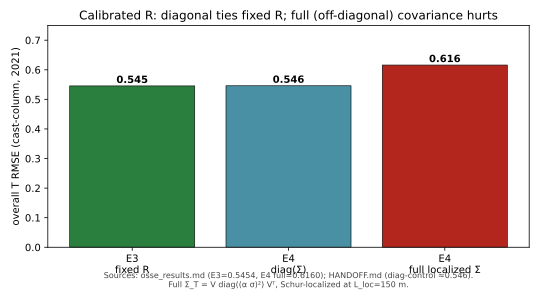


| **R** choice for the same NeSPReSO casts | overall T RMSE    |
| ---------------------------------------- | ----------------- |
| E3 fixed RMSE diagonal                   | 0.545             |
| E4 diagonal Σ only                       | ≈ 0.546 (ties E3) |
| E4 full localized Σ                      | 0.616 (hurts)     |


**Reading for the lab**

1. **Mean profiles:** NeSPReSO ≈ ISOP here — ML did not win the “better synthetic ARGO” contest on fixed **R**.
2. **Uncertainty in OI:** a diagonal learned **R** ties the fixed-**R** setup; adding off-diagonal structure from the CRPS head makes the analysis worse. Those off-diagonals are largely induced by sharing the PCA basis **V** across depths, while the head was trained for **per-dimension (marginal) CRPS**, not for true observation-error correlation.
3. **QC via σ (E5):** using mis-calibrated upper-ocean spreads (§6) as a keep/drop rule did not improve the column analyses.
4. **Scope:** cast-column, vertical-only **B**, one region, one toy OI — a clear negative in *this* testbed, not a verdict on every possible DA scheme.

---


## 8. Side paths we tried and set aside

Short “why it mattered / why we moved on” — main traits only.


| path                             | what it was                                                      | main traits                                      | why set aside                                                                                |
| -------------------------------- | ---------------------------------------------------------------- | ------------------------------------------------ | -------------------------------------------------------------------------------------------- |
| Soft bases only (early B/C vs A) | Change the PCA/EOF target, hope density inversions disappear     | Same truncation rank class; ~22% inversion rates | Soft change does not fix stability; need a hard or inference constraint                      |
| Learned profile AE (ISAS AE-128; ARGO AE-16 recon) | Freeze a nonlinear profile autoencoder; surface model predicts AE latents, then decode | ISAS recon can beat PCA (esp. S); end-to-end ISAS T ~1.5 vs PCA ~1.0; ARGO recon T ~0.39 vs PCA ~0.06 | Compressor win did not transfer to surface→profile skill; ARGO representation floor already prefers PCA; never entered the chrono 3×3 or OSSE |
| Leaked argo16 chrono score       | Evaluate an old random-split checkpoint on the chrono test years | Published T 0.416; chrono look ~0.514            | Training era overlapped the test years — optimistic. Floor rebuilt on a clean chrono retrain |
| Density-only ablation            | Train density, freeze/ignore spice                               | Showed spice still matters for T                 | Refuted “multi-task interference” as the main skill gap                                      |
| a-space low-rank PCA             | Compress softplus-preimage increments                            | Recon RMSE worse than climatology; T ~0.83       | Compress in **physical σ₀**, constrain after                                                 |
| Phase 4 short stage-2            | Stop σ training when loss plateaus                               | Test ENCE ~0.36 (then ~0.23 in matrix v1)        | Under-trained spreads; longer stage-2 + val σ scales needed                                  |
| C×det single-run “admission”     | One lucky seed/path at T 0.562                                   | Looked like C cleared the skill line             | Fair 3-seed matrix: **0.609** — does not replicate                                           |
| Full un-localized Σ in OI        | Use dense Σ_T without Schur localization                         | Numerically explosive (cond ~1e8)                | Localization restores stability; skill still does not beat diagonal                          |


---


## 9. Takeaways (for discussion)

1. **Before July:** we had a working chrono pipeline, a repaired skill floor, a density recipe that looked good in a single run, a probabilistic head that could be calibrated in latent space, and a regional **datacube/sampler** for surface inputs (§1.5).
2. **Bake-off:** best point skill → **B×det (0.534)**; default uncertain model → **A×CRPS**; density/spice **C** did not win skill or physical calibration under the fair protocol.
3. **Learned AE:** a nonlinear profile autoencoder was tried (ISAS end-to-end; ARGO recon check) and did **not** displace PCA for the full pipeline — better compressor ≠ better forecast; ARGO recon alone already prefers PCA.
4. **Uncertainty:** “calibrated in PC space” is not the same as “calibrated in temperature,” especially in the surface and thermocline.
5. **Assimilation proxy:** NeSPReSO ≈ ISOP on fixed R; learned full R did not help; diagonal R is enough in this toy column OI.
6. **Infrastructure vs scoreboard:** the datacube is part of the July package as plumbing/quality — not as evidence that patches beat points.
7. **Still open:** map-level OSSE with ISAS truth + horizontal scales; richer error inputs (v3); whether a head trained for *joint* covariance (not marginal CRPS) would change the E4 story.

---


## Figure index


| figure                       | content                                    |
| ---------------------------- | ------------------------------------------ |
| `figs/system_overview.*`     | inputs → network → latent → T/S            |
| `figs/cube_dataflow.*`       | legacy patches → regional cube → sampler   |
| `figs/abc_schematic.*`       | A vs B vs C                                |
| `figs/heads_schematic.*`     | det / CRPS / NLL                           |
| `figs/matrix_gate_heatmap.*` | 3×3 latent scores + pass/fail              |
| `figs/depthband_season_*.*`  | A×CRPS physical CRPS & ENCE strata         |
| `figs/e_ladder.*`            | E0–E5 meanings                             |
| `figs/osse_panel.*`          | OSSE RMSE bars                             |
| `figs/rcal_diag_vs_full.*`   | fixed / diag / full R                      |
| `figs/eq_oi_update.*`        | OI update equations (Unicode, no LaTeX)    |
| `figs/eq_rcal.*`             | calibrated R equations (Unicode, no LaTeX) |


Machine-checked provenance for the result figures: [`reports/evolution/PROVENANCE.json`](../evolution/PROVENANCE.json).